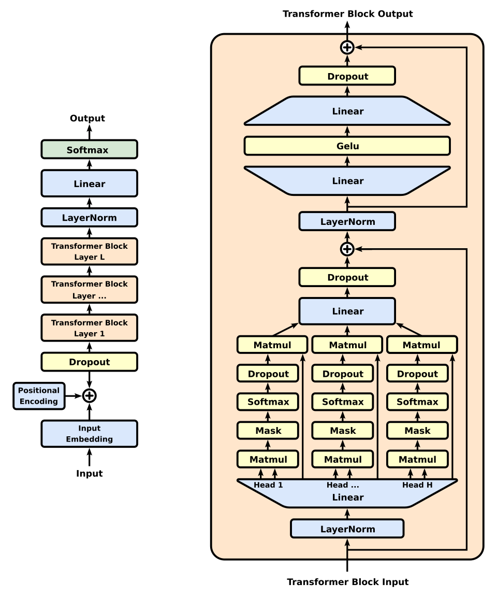
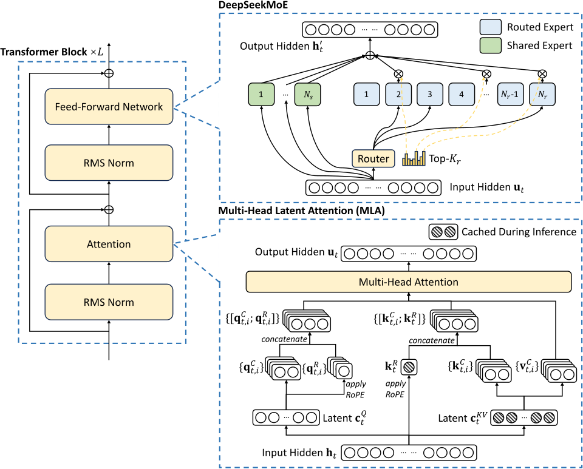
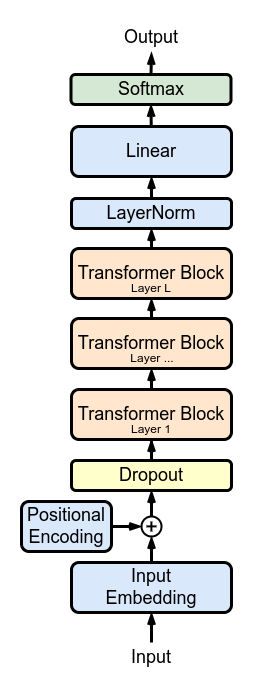
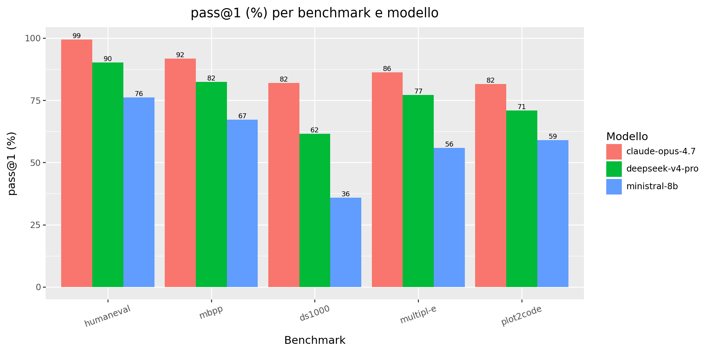
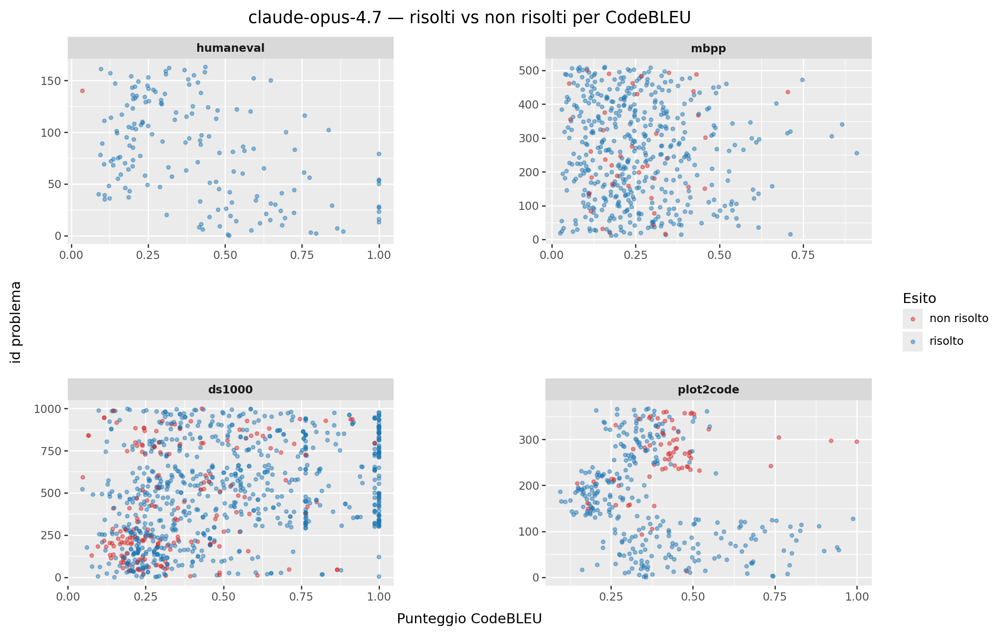
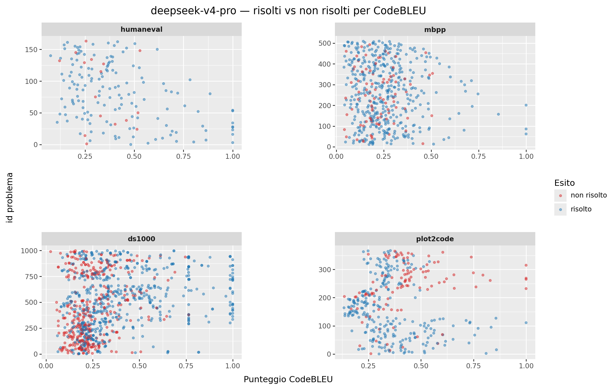
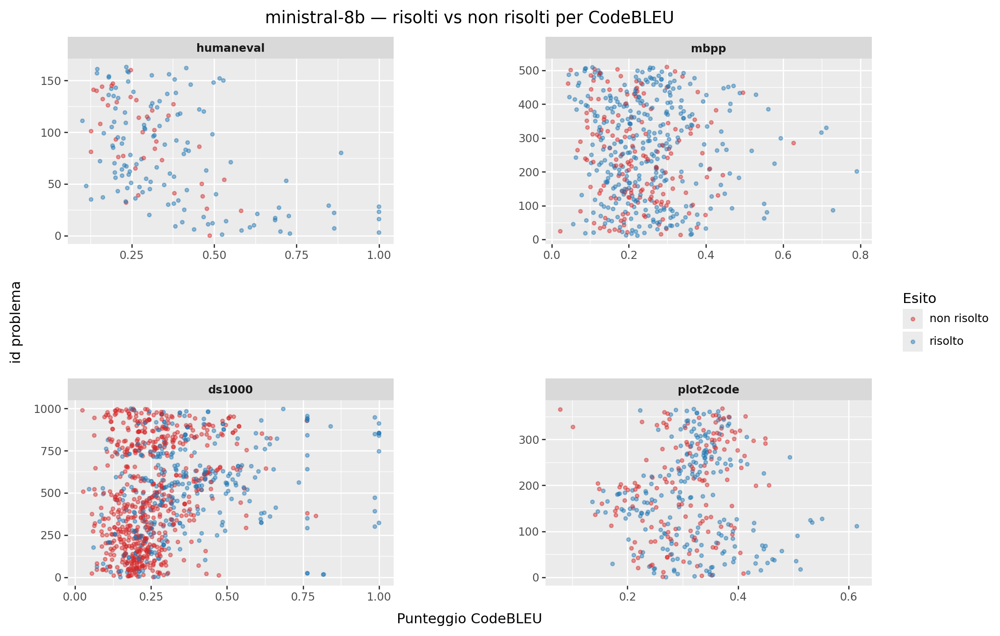
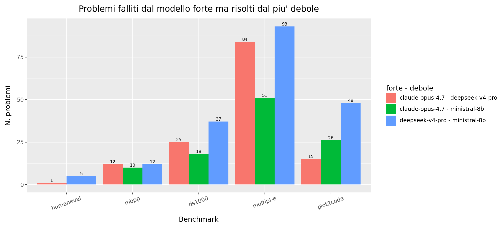
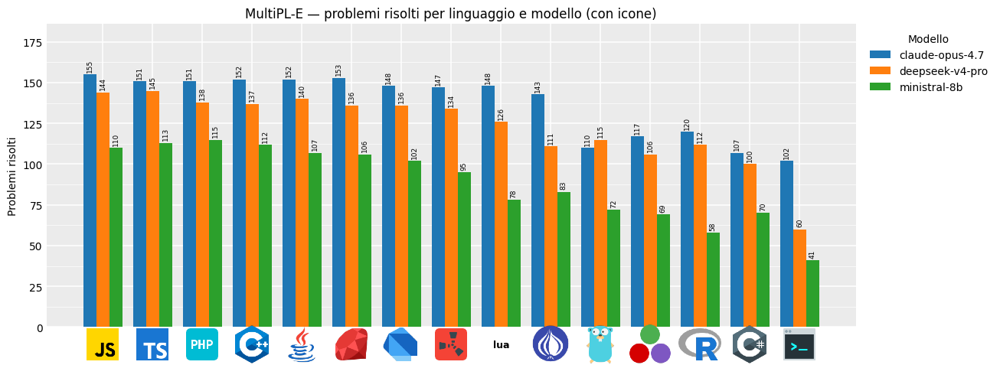
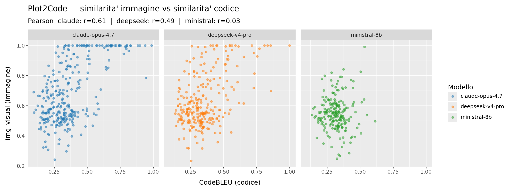

<div align="center">

# 🧪 Code Generation Benchmark: LLM vs MoE vs SLM (HumanEval · MBPP · DS-1000 · Plot2Code · MultiPL-E)

<p align="center">
  
  
  
  
  
</p>

<p align="center">
  
  
  
</p>

<p align="center">
  
  
  
  
  
</p>

</div>

```bash
git clone https://github.com/Imkun-on/Claude-Coding-Evaluation.git
cd Claude-Coding-Evaluation
pip install -r requirements.txt
python cli.py
```

---

## Table of Contents

- [Descrizione del Progetto](#descrizione-del-progetto)
- [Architetture a confronto: LLM, MoE e SLM](#architetture-a-confronto-llm-moe-e-slm)
- [Requisiti & Installazione](#requisiti--installazione)
- [Come si Usa](#come-si-usa)
- [Struttura del Progetto](#struttura-del-progetto)
- [Benchmark: HumanEval](#benchmark-humaneval)
- [Benchmark: MBPP](#benchmark-mbpp)
- [Benchmark: DS-1000](#benchmark-ds-1000)
- [Benchmark: Plot2Code](#benchmark-plot2code)
- [Benchmark: MultiPL-E (multilinguaggio)](#benchmark-multipl-e-multilinguaggio)
- [Prompting: Directional Stimulus (DSP)](#prompting-directional-stimulus-dsp)
- [Metriche di Valutazione](#metriche-di-valutazione)
  - [pass@1](#pass1)
  - [CodeBLEU](#codebleu)
- [Output dei Risultati](#output-dei-risultati)
- [Findings (risultati)](#findings-risultati)
- [Analisi dei Risultati (notebook Jupyter)](#analisi-dei-risultati-notebook-jupyter)
- [Pausa e Ripresa](#pausa-e-ripresa)
- [Analisi degli Errori](#analisi-degli-errori)
- [RAG](#rag)
- [Riferimenti](#riferimenti)
- [License](#license)

---

## Descrizione del Progetto

Questo progetto confronta le capacità di **generazione di codice** di tre modelli linguistici
appartenenti a famiglie architetturali diverse: un **LLM denso** di frontiera (Claude Opus 4.7),
un **Mixture of Experts** (DeepSeek V4 Pro) e uno **Small Language Model** (Ministral 8B).
L'interesse non è stabilire quale prodotto commerciale sia migliore, ma osservare come si
comportano le tre **architetture** sullo stesso compito, a prescindere dalle differenze nei dati
di addestramento, nel numero di parametri e nelle scelte di ottimizzazione dei singoli provider.
Le tre architetture sono descritte nella sezione
[Architetture a confronto](#architetture-a-confronto-llm-moe-e-slm).

La valutazione impiega **cinque benchmark**: quattro di essi (HumanEval, MBPP, DS-1000 e
Plot2Code) sono incentrati sul linguaggio **Python**, mentre **MultiPL-E** estende il confronto a
**24 linguaggi di programmazione**. Per contenere i costi computazionali, di questi 24 linguaggi
ne vengono effettivamente eseguiti **15**, quelli per cui è disponibile un runtime affidabile
sulla macchina di test (l'elenco completo è nella sezione *Benchmark: MultiPL-E*).

L'obiettivo è misurare quanto i modelli riescano a risolvere i problemi di programmazione che
vengono loro posti **al primo tentativo**. A questo scopo si impiegano due metriche complementari:

- **pass@k**, la metrica di correttezza funzionale: stima la probabilità che almeno una delle k
  soluzioni generate dal modello superi tutti gli unit test del problema. In questo lavoro
  **k = 1** (pass@1): il modello dispone di un solo tentativo, la condizione più severa e più
  vicina all'uso reale.
- **CodeBLEU**, una metrica strutturale pensata specificamente per il codice: confronta il codice
  generato dal modello con la soluzione di riferimento del benchmark combinando quattro
  componenti (sovrapposizione degli n-grammi, n-grammi pesati sulle parole chiave del linguaggio,
  similarità degli alberi sintattici e similarità del flusso dei dati tra variabili). Il
  confronto avviene a prescindere dal fatto che il codice generato sia funzionante o meno: misura
  quanto la soluzione **somiglia** a quella di riferimento, non se è corretta. Il funzionamento
  dettagliato è descritto nella sezione *Metriche di Valutazione*.

Per ogni run vengono inoltre tracciati **token e costo** e, per i problemi non risolti, la
**categoria di errore** (SyntaxError, AssertionError, TimeoutError, ecc.).

Due note sui benchmark meno convenzionali:

> **Plot2Code** (`TencentARC/Plot2Code`) è il benchmark di **visualizzazione**: data la
> descrizione testuale di una figura, il modello genera lo **script matplotlib**; la correttezza
> è il **rendering riuscito** (pass@1), affiancato dal CodeBLEU e da una **similarità d'immagine**
> composita.
>
> **MultiPL-E** (`nuprl/MultiPL-E`, set HumanEval) è il benchmark **multilinguaggio**: gli stessi
> problemi di HumanEval tradotti nei vari linguaggi, riuniti in un unico benchmark con la colonna
> `language` e un solo file di risultato. Non fornisce la soluzione gold, quindi la metrica è
> **solo pass@1** (niente CodeBLEU). Il pass@1 richiede il runtime del linguaggio installato; per
> non sprecare chiamate API, la pipeline rileva i runtime presenti e **genera solo per quei
> linguaggi** (i restanti risultano `RuntimeMissing`).

---

## Architetture a confronto: LLM, MoE e SLM

Tutti e tre i modelli condividono la stessa base: il **Transformer decoder-only**, addestrato in
pre-training a predire il token successivo su grandi corpora di testo e codice, e successivamente
raffinato in post-training (instruction tuning e apprendimento per rinforzo da feedback umano).
Ciò che distingue le tre famiglie è **come i parametri sono organizzati e quanti ne vengono
attivati** per generare ciascun token.

### LLM denso (Claude Opus 4.7)

In un modello **denso** ogni token attraversa **tutti** i parametri della rete: in ciascun blocco
Transformer sia l'attenzione sia lo strato feed-forward partecipano al calcolo di ogni token
generato. È l'architettura con la capacità potenziale più alta, perché l'intera rete contribuisce
a ogni predizione, ma anche la più costosa, dato che il costo di inferenza cresce con la
dimensione totale del modello. I modelli di frontiera di questa famiglia vengono addestrati su
corpora dell'ordine delle **decine di trilioni di token** (testo, codice e dati sintetici);
Anthropic non divulga il numero di parametri né la composizione esatta dei dati di addestramento
di Claude Opus 4.7.

### Mixture of Experts (DeepSeek V4 Pro)

In un modello **MoE** lo strato feed-forward di ogni blocco è sostituito da un insieme di
**esperti** (copie indipendenti dello strato) e da un **router** appreso che, token per token,
instrada il calcolo solo verso un piccolo sottoinsieme di esperti. DeepSeek V4 Pro dichiara
**284 miliardi di parametri totali, di cui circa 13 miliardi attivi** per token: la conoscenza
complessiva è quella di un modello grande, il costo di inferenza quello di un modello
medio-piccolo. Il prezzo si paga in fase di addestramento: il router va bilanciato con funzioni
di perdita ausiliarie, per evitare che pochi esperti monopolizzino il traffico, e il modello
richiede comunque memoria sufficiente a ospitare tutti gli esperti, anche quelli inattivi.

### Small Language Model (Ministral 8B)

Uno **SLM** è un modello denso di piccola taglia (in questo caso **8 miliardi di parametri**),
progettato per girare con poche risorse: dispositivi edge, esecuzione locale, latenze basse. Non
potendo contare sulla scala, la sua qualità dipende in modo critico dalla **cura dei dati di
addestramento**: filtraggio aggressivo dei corpora, dati sintetici di alta qualità e
distillazione della conoscenza da modelli più grandi. È l'architettura con il rapporto
costo/prestazioni più spinto, ma con un tetto di capacità strutturalmente più basso, come i
risultati di questo benchmark mostrano chiaramente.

### Confronto visivo delle tre architetture

I tre schemi seguenti, affiancati, evidenziano la differenza chiave. A sinistra il modello
**denso** in stile GPT: uno stack di blocchi Transformer in cui ogni token attraversa l'unico
strato feed-forward di ciascun blocco, quindi tutti i parametri. Al centro il blocco **MoE** di
DeepSeek: lo strato feed-forward è sostituito da molti esperti (in azzurro quelli instradati, in
verde quelli condivisi) e il router ne attiva solo una piccola parte per ogni token. A destra lo
stack decoder-only di uno **SLM**: la stessa architettura densa del primo schema, ma con molti
meno blocchi e dimensioni interne ridotte.

<table>
<tr>
<th align="center">LLM denso (Claude Opus 4.7)</th>
<th align="center">Mixture of Experts (DeepSeek V4 Pro)</th>
<th align="center">SLM (Ministral 8B)</th>
</tr>
<tr>
<td align="center" width="38%"></td>
<td align="center" width="44%"></td>
<td align="center" width="18%"></td>
</tr>
</table>

### Confronto sintetico

| Caratteristica | LLM denso | MoE | SLM |
|----------------|-----------|-----|-----|
| Modello testato | Claude Opus 4.7 | DeepSeek V4 Pro | Ministral 8B |
| Parametri totali | non dichiarati (frontier) | 284B | 8B |
| Parametri attivi per token | tutti | ~13B | tutti (8B) |
| Dati di addestramento | decine di trilioni di token (composizione non divulgata) | trilioni di token (testo + codice) | corpus curato, distillazione da modelli maggiori |
| Costo di inferenza | alto | medio-basso | molto basso |
| Punto di forza | capacità massima | rapporto capacità/costo | esecuzione locale, latenza |

### Modelli e prezzi

Si confronta un modello rappresentativo per ciascuna famiglia (un confronto per *architettura*,
non un campionato tra brand):

| key | Architettura | Provider | model_id | Prezzo $/1M (in/out) |
|-----|--------------|----------|----------|----------------------|
| `claude-opus-4.7` | **LLM** (dense, frontier) | anthropic | `claude-opus-4-7` | 5.00 / 25.00 |
| `deepseek-v4-pro` | **MoE** (284B tot / 13B attivi) | deepseek | `deepseek-v4-pro` | 0.14 / 0.28 |
| `ministral-8b` | **SLM** (8B, edge/efficiente) | mistral | `ministral-8b-latest` | 0.10 / 0.10 |

---

## Requisiti & Installazione

### Python

Richiede **Python 3.10+** (sviluppato e testato su **Python 3.14 / Windows 11**).

---

### Installazione dipendenze

```bash
pip install -r requirements.txt
```

> **⚠️ Nota CodeBLEU / tree-sitter (importante su Python 3.14).**
> `codebleu` fissa `tree-sitter<0.23`, che **non ha una wheel per cp314** e fallisce la build
> da sorgente. Se `pip install -r requirements.txt` dà errore su `tree-sitter`, installa in
> due passi:
> ```bash
> pip install tree-sitter tree-sitter-python
> pip install codebleu --no-deps
> ```
> A runtime `codebleu` 0.7 funziona correttamente con `tree-sitter` 0.25 nonostante il pin.

| Libreria | Scopo |
|----------|-------|
| `anthropic` | SDK ufficiale per interrogare Claude Opus 4.7 |
| `datasets` + `huggingface-hub` | Caricamento di HumanEval da Hugging Face |
| `codebleu` + `tree-sitter` + `tree-sitter-python` | Metrica strutturale CodeBLEU (AST + data-flow) |
| `openpyxl` | Export del dettaglio in Excel (`.xlsx`) |
| `typer` | CLI: costruisce i comandi dai type-hint e genera l'`--help` (porta con sé `click`) |
| `rich` | Interfaccia CLI: `--help` formattato, tabelle, barra di avanzamento, pannelli |
| `python-dotenv` | Caricamento della API key da file `.env` |
| `pandas`, `numpy`, `scipy`, `scikit-learn`, `matplotlib`, `torch` | **(solo DS-1000)** runtime per eseguire le soluzioni che importano queste librerie |

> **⚠️ Librerie per DS-1000.** A differenza di HumanEval/MBPP (solo stdlib), **DS-1000 esegue
> codice che importa librerie di data science**, che **non** sono in `requirements.txt` (lì stanno
> solo le dipendenze del core). Per eseguire DS-1000 installale a parte:
> ```bash
> pip install pandas numpy scipy scikit-learn matplotlib torch
> ```
> La pipeline **rileva automaticamente** quali sono installate ed **esegue solo i problemi delle
> librerie presenti**, saltando le altre con un avviso (niente tagli silenziosi: vedi *Benchmark:
> DS-1000*). Su **Python 3.14 TensorFlow non ha ancora una wheel**, quindi i suoi **45 problemi**
> vengono esclusi e il pass@1 è riportato su **955/1000**.

> **⚠️ Dipendenze per Plot2Code.** Plot2Code renderizza figure: servono `matplotlib` e `Pillow`
> (non in `requirements.txt`). Per la sola componente testo della similarità immagine serve anche
> `pytesseract` **+** il motore Tesseract installato a parte; senza, SSIM e colore si calcolano
> comunque.
> ```bash
> pip install matplotlib pillow
> ```

> **⚠️ Toolchain per MultiPL-E (multilinguaggio).** Il `pass@1` di MultiPL-E richiede il **runtime
> del linguaggio** installato (Node, JDK, Go, Rust, …): senza, l'executor segna `RuntimeMissing` e
> prosegue. L'elenco completo dei linguaggi con i **comandi `winget`** per installarli (e un blocco
> "installazione rapida" copia-incolla) è nella sezione *Benchmark: MultiPL-E*.

---

### Configurazione della API Key

Il benchmark interroga ciascun modello tramite l'API del rispettivo provider: **Anthropic** per
Claude, **DeepSeek** per DeepSeek V4 Pro e **Mistral** per Ministral 8B. Imposta le API key dei
provider che vuoi testare prima di avviare, oppure mettile in un file `.env` nella root del
progetto:

```bash
ANTHROPIC_API_KEY=la-tua-api-key
DEEPSEEK_API_KEY=la-tua-api-key
MISTRAL_API_KEY=la-tua-api-key
```

> Vengono eseguiti **solo i modelli per cui è impostata la API key**: gli altri sono saltati con
> un avviso. Basta quindi la chiave di **almeno un** provider (puoi lanciare anche solo uno dei
> tre modelli); con tutte e tre le chiavi ottieni il confronto completo LLM vs MoE vs SLM. I
> `model_id` e i prezzi vanno verificati sulle console dei provider (cambiano spesso); per
> scegliere un sottoinsieme ripeti l'opzione `--models` (es. `--models claude-opus-4.7 --models
> deepseek-v4-pro`).

Oppure come variabili d'ambiente:

Su Windows (PowerShell):

```powershell
$env:ANTHROPIC_API_KEY="la-tua-api-key"
$env:DEEPSEEK_API_KEY="la-tua-api-key"
$env:MISTRAL_API_KEY="la-tua-api-key"
```

Su Linux/macOS:

```bash
export ANTHROPIC_API_KEY="la-tua-api-key"
export DEEPSEEK_API_KEY="la-tua-api-key"
export MISTRAL_API_KEY="la-tua-api-key"
```

> Puoi ottenere una API key dalle console dei provider:
> [console.anthropic.com](https://console.anthropic.com) (Claude),
> [platform.deepseek.com](https://platform.deepseek.com) (DeepSeek) e
> [console.mistral.ai](https://console.mistral.ai) (Mistral).

---

## Come si Usa

L'entrypoint è `cli.py` (equivalente a `python -m model.claude`). La CLI è costruita con
**Typer**: l'`--help` è formattato da **Rich** (opzioni raggruppate in pannelli) e ogni opzione ha
anche una **forma breve** (`-b`, `-n`, `-m`, `-t`).

```bash
python cli.py
python cli.py --benchmark mbpp
python cli.py -b humaneval
python cli.py --benchmark ds1000
python cli.py --benchmark ds1000 --libraries Pandas --libraries Numpy
python cli.py --benchmark plot2code
python cli.py --benchmark multipl-e
python cli.py -b multipl-e -n 3
python cli.py --benchmark mbpp -n 5
python cli.py --models claude-opus-4.7 --models deepseek-v4-pro
python cli.py --benchmark mbpp --fresh
python cli.py --list
```

Il significato di ogni opzione (con la forma breve e il valore di default) è riassunto nella
tabella seguente; per MultiPL-E il limite `-n` è inteso **per linguaggio**.

> **Opzioni multi-valore (Typer).** Per indicare più valori, **ripeti l'opzione**:
> `--models a --models b`, `--libraries Pandas --libraries Numpy` (non più separati da spazio).

Se ometti `--benchmark`, all'avvio viene mostrato un menù che ti fa scegliere
(Invio = HumanEval). I risultati di ciascun benchmark finiscono in una **sottocartella
dedicata**: `results/humaneval/`, `results/mbpp/` o `results/ds1000/` (vedi *Output dei Risultati*).

| Flag | Default | Descrizione |
|------|---------|-------------|
| `--benchmark` / `-b` `NAME` | *chiesto a runtime* | Quale benchmark: `humaneval` / `mbpp` / `ds1000` / `plot2code` / `multipl-e`. Se omesso, menù interattivo |
| `--limit` / `-n` `N` | tutti (164 HumanEval / 500 MBPP / 1000 DS-1000 / 368 Plot2Code / ~161×24 MultiPL-E) | Numero di problemi (utile per test economici). Per MultiPL-E è **per linguaggio** |
| `--libraries` `LIB` | tutte le installate | **(solo DS-1000)** limita alle librerie indicate; **ripeti** per più (es. `--libraries Pandas --libraries Numpy`, case-insensitive). Le non installate vengono saltate con avviso |
| `--models` / `-m` `KEY` | tutti (con API key) | Chiavi modello da testare; **ripeti** per più (es. `-m claude-opus-4.7 -m deepseek-v4-pro`) |
| `--timeout` / `-t` `SEC` | *per benchmark*: 10 HumanEval/MBPP · 60 DS-1000/Plot2Code · 30 MultiPL-E | Timeout in secondi per l'esecuzione di ogni test |
| `--fresh` | off | Ignora il checkpoint e riparte da zero (cancella i `.jsonl`) |
| `--list` | n/d | Elenca i modelli configurati ed esce |
| `--help` / `-h` | n/d | Mostra l'aiuto (formattato con Rich) ed esce |

> ⚠️ Non lanciare direttamente i file dentro `model/` (es. `python model/pipeline.py`):
> usano import relativi e darebbero errore. Usa `python cli.py` o `python -m model.claude`.

---

### Configurazione dell'inferenza

I parametri di generazione stanno in `model/config.py`:

| Parametro | Valore | Note |
|-----------|--------|------|
| `CLAUDE_EFFORT` | `low` | `low\|medium\|high\|xhigh\|max`; alza per misurare la capacità massima |
| `CLAUDE_THINKING` | `disabled` | `disabled\|adaptive` |
| `MAX_TOKENS` | `2048` | margine per firma + import + corpo funzione |

> **⚠️ Parametri API Opus 4.7.** `temperature`/`top_p`/`top_k` sono **rimossi** (inviarli dà
> errore 400). Il controllo del comportamento avviene tramite `output_config={"effort": …}` e
> `thinking={"type": …}`. Prezzi: **$5 / 1M token input**, **$25 / 1M token output**.
> Un run completo costa circa **$0.85**.

> **Modelli di confronto (DeepSeek, Mistral).** Usano l'API **OpenAI-compatibile** (stesso client
> `openai`, cambiano solo `base_url` e chiave) e **supportano `temperature`**, impostata a `0.0`
> in `config.py` per il determinismo. Non hanno `effort`/`thinking`: il loro comportamento è
> guidato solo da `SYSTEM_PROMPT` + DSP, **identici per tutti i modelli** (confronto equo). Costano
> molto meno di Claude (vedi *Modelli a confronto*).

---

## Struttura del Progetto

`model/` è un **namespace package** (volutamente senza `__init__.py`), con file piatti:

```
Model_Test_Benchmark/
├── cli.py                  # entrypoint: parsing argomenti + run_benchmark
├── requirements.txt
├── Benchmark/humaneval/    # dataset HumanEval salvato in locale (save_to_disk)
├── Benchmark/mbpp/         # dataset MBPP salvato in locale (config full, test 11-510)
├── Benchmark/ds1000/       # dataset DS-1000 salvato in locale (1000 problemi)
├── Benchmark/plot2code/    # dataset Plot2Code salvato in locale (+ PNG di riferimento)
├── Benchmark/multipl_e/    # dataset MultiPL-E salvato in locale (un sottoinsieme humaneval-<lang> per linguaggio)
├── lib/                    # jar di supporto per Java (es. javatuples-1.2.jar) nel classpath
├── results/                # output dei run, in sottocartelle per benchmark:
│   ├── humaneval/          #   json, csv, jsonl, xlsx del run HumanEval
│   ├── mbpp/               #   json, csv, jsonl, xlsx del run MBPP
│   ├── ds1000/             #   json, csv, jsonl, xlsx del run DS-1000
│   ├── plot2code/          #   + sottocartella rendered/<modello>/ con i PNG generati
│   └── multipl-e/          #   UN file unico con la colonna `language` (24 linguaggi insieme)
├── analysis/               # notebook Jupyter di analisi dei risultati
│   ├── results_analysis.ipynb   # tabelle + grafici (plotnine)
│   ├── build_notebook.py        # genera il notebook
│   ├── export_plots.py          # esporta i grafici in plots/
│   └── icons/                   # loghi linguaggi (grafico MultiPL-E)
├── plots/                  # grafici esportati (PNG) per il README
└── model/
    ├── config.py           # ModelSpec, SYSTEM_PROMPT, parametri inferenza, PRICING, env keys
    ├── providers.py        # modelli (1 per architettura) + generate(spec, prompt) per provider
    ├── claude.py           # entrypoint standalone `python -m model.claude`
    ├── humaneval.py        # caricamento HumanEval + colonna derivata "codice_completo"
    ├── mbpp.py             # caricamento MBPP (config full, solo test: task_id 11-510)
    ├── ds1000.py           # caricamento DS-1000 + rilevamento librerie installate (--libraries)
    ├── plot2code.py        # caricamento Plot2Code (instruction + figura di riferimento)
    ├── multipl_e.py        # caricamento MultiPL-E (24 config humaneval-<lang> in un'unica lista)
    ├── image_similarity.py # confronto immagini composito per Plot2Code (SSIM + colore + OCR)
    ├── prompting.py        # Directional Stimulus Prompting (DSP)
    ├── code_extractor.py   # isola il codice dalla risposta del modello (qualsiasi linguaggio)
    ├── executor.py         # esegue il codice contro gli unit test (in sandbox/subprocess)
    ├── metrics.py          # CodeBLEU
    ├── pipeline.py         # orchestrazione: esecuzione, checkpoint, barra, report finale
    ├── report.py           # aggregazione (pass@1, errori, token/costo) e tabelle rich
    └── export.py           # export del dettaglio in CSV e XLSX
```

---

## Benchmark: HumanEval

<table>
<tr>
<td width="120"><strong>🔗 Dataset</strong></td>
<td><a href="https://huggingface.co/datasets/openai/openai_humaneval">openai/openai_humaneval</a></td>
</tr>
<tr>
<td><strong>📄 Paper</strong></td>
<td><a href="https://arxiv.org/abs/2107.03374">Evaluating Large Language Models Trained on Code</a> (OpenAI, 2021)</td>
</tr>
</table>

Caricamento del dataset in `model/humaneval.py` (164 problemi):

```python
from datasets import load_dataset
ds = load_dataset("openai/openai_humaneval", split="test")
```

HumanEval è un benchmark di OpenAI composto da **164 problemi di programmazione** scritti a mano,
simili a domande da colloquio software. Ogni problema include una **firma di funzione**, una
**docstring** che descrive il comportamento atteso e una serie di **unit test** (in media 7.7 per
problema).

---

### Struttura del Dataset

| Colonna | Tipo | Descrizione |
|---------|------|-------------|
| `task_id` | `string` | Identificatore univoco (es. `"HumanEval/0"`) |
| `prompt` | `string` | Import + firma della funzione + docstring con le istruzioni |
| `canonical_solution` | `string` | **Solo il corpo** della soluzione di riferimento (indentato) |
| `test` | `string` | Funzione di test con gli unit test per validare il codice |
| `entry_point` | `string` | Nome della funzione da implementare |

---

### Colonna derivata: `codice_completo`

In HumanEval la `prompt` contiene import + firma + docstring, mentre `canonical_solution`
contiene **solo il corpo** della funzione. Al caricamento (`humaneval.py`) costruiamo una colonna
derivata:

```
codice_completo = prompt + canonical_solution
```

cioè la **funzione di riferimento completa ed eseguibile** (import + firma + docstring + corpo).
Questo è il riferimento usato per il **CodeBLEU**: il modello genera anch'esso la funzione
completa, quindi il confronto "completa vs completa" è equo (vedi sotto).

#### Esempio (problema `HumanEval/0`)

`prompt` (import + firma + docstring):

```python
from typing import List

def has_close_elements(numbers: List[float], threshold: float) -> bool:
    """ Check if in given list of numbers, are any two numbers closer to each
    other than given threshold.
    >>> has_close_elements([1.0, 2.0, 3.0], 0.5)
    False
    """
```

`canonical_solution` (solo il corpo, indentato):

```python
    for idx, elem in enumerate(numbers):
        for idx2, elem2 in enumerate(numbers):
            if idx != idx2 and abs(elem - elem2) < threshold:
                return True
    return False
```

La concatenazione dei due (`codice_completo = prompt + canonical_solution`) è la funzione
completa di riferimento.

---

### Nota Windows sul caricamento

Il dataset viene scaricato una volta e salvato in `Benchmark/humaneval/` con `save_to_disk`,
poi riletto da lì ai run successivi. **Non** usiamo `load_dataset(cache_dir=Benchmark)` perché il
file di lock di Hugging Face incorpora l'intero path assoluto e, su percorsi profondi, supera il
limite di 260 caratteri di Windows.

---

## Benchmark: MBPP

<table>
<tr>
<td width="120"><strong>🔗 Dataset</strong></td>
<td><a href="https://huggingface.co/datasets/google-research-datasets/mbpp">google-research-datasets/mbpp</a></td>
</tr>
<tr>
<td><strong>📄 Paper</strong></td>
<td><a href="https://arxiv.org/abs/2108.07732">Program Synthesis with Large Language Models</a> (Austin et al., Google, 2021)</td>
</tr>
</table>

Caricamento in `model/mbpp.py`: si carica la config `full` e si filtra il test set
(`task_id` da 11 a 510, 500 problemi):

```python
from datasets import load_dataset
ds = load_dataset("google-research-datasets/mbpp", "full")
```

**MBPP** (*Mostly Basic Python Problems*) è un secondo benchmark di generazione di codice:
problemi descritti in **linguaggio naturale** (non da firma+docstring come HumanEval), ciascuno
con una **soluzione di riferimento** e una lista di `assert` da superare.

---

### Esempio (problema `task_id 12`)

`text` (descrizione in linguaggio naturale, è l'input al modello):

```text
Write a function to sort a given matrix in ascending order according to the sum of its rows.
```

`code` (soluzione di riferimento: è già la funzione completa, `def` + corpo):

```python
def sort_matrix(M):
    result = sorted(M, key=sum)
    return result
```

`test_list` (gli `assert` che il codice deve superare):

```python
assert sort_matrix([[1, 2, 3], [2, 4, 5], [1, 1, 1]]) == [[1, 1, 1], [1, 2, 3], [2, 4, 5]]
```

> A differenza di HumanEval non c'è una firma da cui partire: il prompt deduce nome e firma della
> funzione **dai test** (vedi *Prompting: Directional Stimulus*).

---

### Quale parte di MBPP usiamo

Il dataset "full" (974 problemi) è diviso **per intervalli di `task_id`** (convenzione del paper):

| Split | `task_id` | Problemi | A cosa serve |
|---|---|---:|---|
| `prompt` | 1-10 | 10 | esempi few-shot da inserire nel prompt |
| **`test`** | **11-510** | **500** | **valutazione ← usiamo questo** |
| `validation` | 511-600 | 90 | tuning degli iperparametri |
| `train` | 601-974 | 374 | fine-tuning |

Usiamo **solo lo split `test` (500 problemi, `task_id` 11-510)**: è l'insieme di valutazione
held-out su cui i paper riportano il pass@1. Gli altri split non servono al nostro caso
(zero-shot, nessun addestramento, nessun tuning sistematico).

> **Robustezza alla versione del dataset.** I *nomi* degli split possono variare tra le
> revisioni del dataset, ma il `task_id` è l'identità **stabile** di ogni problema. Per questo
> `mbpp.py` non si fida dell'etichetta dello split: carica la config "full", unisce tutte le
> righe e seleziona il test **filtrando per `task_id` 11-510**. Così otteniamo sempre gli stessi
> 500 problemi, comunque siano etichettati gli split nella copia scaricata.

---

### Perché `full` e NON `sanitized`

MBPP ha due configurazioni: **`full`** (974 problemi) e **`sanitized`** (427, sottoinsieme
verificato a mano che **rimuove** i problemi con descrizioni ambigue/sgrammaticate e **lima** la
formulazione di altri). La scelta naturale per un confronto "pulito" sarebbe `sanitized`, ma qui
usiamo **deliberatamente `full`**, per una ragione precisa:

- **Vogliamo testare anche la robustezza ai prompt scritti male.** Una parte dei problemi di
  `full` ha descrizioni imperfette (grammatica zoppa, fraseggio ambiguo). Valutare Claude *anche*
  su questi misura una capacità reale e interessante (**regge una specifica formulata male?**)
  che `sanitized`, ripulendo tutto, nasconderebbe.
- **Il numero su 500 è quello "classico"**, il più confrontabile con la letteratura, che storicamente
  riporta i risultati sul test set di `full`.
- **Non perdiamo l'informazione di `sanitized`: la riusiamo come etichetta.** I `task_id`
  sopravvissuti alla sanitizzazione identificano i problemi "puliti". Questo permette (in fase di
  analisi) di suddividere i 500 in due gruppi, **"clean"** (presenti in `sanitized`) e **"noisy"**
  (scartati/riformulati), e di confrontare il pass@1 nei due. Il **divario** tra i due gruppi *è*
  la misura del costo che una cattiva formulazione impone al modello.

> ⚠️ **Avvertenza d'interpretazione.** Alcuni problemi scartati da `sanitized` non sono solo
> "scritti male": sono **sotto-specificati** (il test pretende qualcosa che il prompt non dice).
> Su quelli nemmeno un modello perfetto può sempre indovinare. Quindi un pass@1 più basso sul
> gruppo "noisy" va letto come *performance su prompt rumorosi (parte dei quali irrisolvibili)*,
> non come "il modello è peggiore".

---

### Struttura del Dataset (config `full`)

| Colonna | Descrizione |
|---------|-------------|
| `task_id` | Identificatore intero del problema (es. `11`) |
| `text` | Descrizione del problema in linguaggio naturale |
| `code` | Soluzione di riferimento: **già la funzione completa** (`def` + corpo) |
| `test_list` | Lista di `assert` che il codice deve superare |
| `test_setup_code` | Eventuale codice di setup/import per i test (spesso vuoto) |
| `challenge_test_list` | Test extra più severi (opzionali) |

> Nota CodeBLEU: a differenza di HumanEval, in MBPP `code` è **già** la funzione completa, quindi
> **non** serve costruire un `codice_completo` per concatenazione: `code` è già il riferimento
> completo con cui confrontare il codice generato.

Come per HumanEval, il dataset viene salvato in locale in `Benchmark/mbpp/` (con `save_to_disk`)
al primo run e riletto da lì in seguito.

---

## Benchmark: DS-1000

<table>
<tr>
<td width="120"><strong>🔗 Dataset</strong></td>
<td><a href="https://huggingface.co/datasets/xlangai/DS-1000">xlangai/DS-1000</a></td>
</tr>
<tr>
<td><strong>📄 Paper</strong></td>
<td><a href="https://arxiv.org/abs/2211.11501">DS-1000: A Natural and Reliable Benchmark for Data Science Code Generation</a> (Lai et al., 2022)</td>
</tr>
</table>

Caricamento in `model/ds1000.py`, via pandas dallo stream Hugging Face (1000 problemi):

```python
import pandas as pd
df = pd.read_json("hf://datasets/xlangai/DS-1000/test.jsonl", lines=True)
```

**DS-1000** raccoglie **1000 problemi di data science** presi da domande reali di StackOverflow su
**7 librerie** Python. A differenza di HumanEval/MBPP (problemi "da zero" sulla sola stdlib), qui il
modello deve **completare uno snippet** che usa una libreria specifica, e la valutazione è **per
esecuzione** contro un harness ufficiale.

Distribuzione dei problemi per libreria (nomi come compaiono nel dataset; attenzione: è
`Sklearn`, non `Scikit-learn`):

| Pandas | Numpy | Matplotlib | Sklearn | Scipy | Pytorch | Tensorflow | **Totale** |
|---:|---:|---:|---:|---:|---:|---:|---:|
| 291 | 220 | 155 | 115 | 106 | 68 | 45 | **1000** |

---

### Struttura del Dataset

| Colonna | Descrizione |
|---------|-------------|
| `prompt` | Descrizione del problema + scheletro di codice con il punto da completare |
| `reference_code` | Soluzione gold (frammento): **riferimento per il CodeBLEU** |
| `code_context` | **Harness di test completo**: definisce `test_execution(solution)` (ed eventualmente `test_string`), con il segnaposto `[insert]`. Solleva `AssertionError` se la soluzione è sbagliata |
| `metadata` | Dict con `problem_id`, `library`, `perturbation_type`, `test_case_cnt` |

> **`task_id` derivato.** In DS-1000 il `task_id` non è una colonna: lo ricaviamo da
> `metadata.problem_id` (intero 0-999) e lo aggiungiamo per compatibilità con la pipeline
> (checkpoint, dedup, report). Il riferimento CodeBLEU è `reference_code` (la soluzione gold),
> **mai** il `code_context` (che è il grader, non un riferimento di codice).

---

### Esempio (libreria Numpy, formato *Completion*)

`prompt` (problema in linguaggio naturale + scaffold con il punto da completare):

```text
Problem:
How do I get the dimensions of an array? For instance, this is (2, 2):
a = np.array([[1,2],[3,4]])

A:
<code>
import numpy as np
a = np.array([[1,2],[3,4]])
</code>
result = ... # put solution in this variable
BEGIN SOLUTION
```

`reference_code` (soluzione gold, riferimento per il CodeBLEU):

```python
result = a.shape
```

> La soluzione del modello viene inserita al posto di `[insert]` nell'`code_context` ed eseguita:
> il test confronta `result` con l'atteso. Vedi *Due formati di risposta* qui sotto.

---

### Due formati di risposta: Completion e Insertion

DS-1000 inserisce la soluzione del modello al posto di `[insert]` nell'harness. A seconda di dove
si trova `[insert]`, la soluzione attesa ha **due forme** diverse; la pipeline le riconosce
guardando la riga che precede `[insert]`:

- **Completion**: `[insert]` è a livello di modulo (es. dopo `df = test_input`): la soluzione è
  uno **snippet** che assegna la variabile `result`.
- **Insertion**: `[insert]` è **dentro** una funzione (`def f(df):`): la soluzione è il **corpo**
  della funzione, va **indentata** e termina con `return`.

> **Indentazione gestita dalla pipeline, non dal modello.** Per il formato *Insertion* chiediamo al
> modello di scrivere il corpo **a colonna 0** e l'**executor** lo reindenta nel punto giusto
> (`textwrap.indent`/`dedent`), preservando anche la struttura di eventuali cicli. Questo evita il
> tipico difetto degli LLM (prima riga a colonna 0, resto indentato) che produceva un
> `IndentationError` pur essendo la logica corretta.

---

### Esecuzione e librerie installate

Il programma di verifica è `code_context` + la chiamata a `test_execution(<soluzione>)` (per i
problemi *Matplotlib* viene forzato il backend non interattivo `Agg`). Poiché ogni libreria va
**davvero importata**, la pipeline **rileva automaticamente** quali sono installate e **salta** i
problemi delle altre, **senza tagli silenziosi**:

- All'avvio il pannello elenca le librerie eseguite e avvisa di quelle saltate, indicando quanti
  problemi escludono e su quanti è calcolato il pass@1 (es. *955/1000*).
- Con `--libraries` puoi restringere ai sottoinsiemi che ti interessano (es.
  `--libraries Pandas Numpy Pytorch`, case-insensitive).

> **TensorFlow su Python 3.14.** Al momento TensorFlow **non ha una wheel per Python 3.14**
> (`pip install tensorflow` → *No matching distribution*), quindi i suoi **45 problemi** non sono
> eseguibili e vengono esclusi: il pass@1 viene riportato su **955/1000**. Per eseguirli serve un
> ambiente Python 3.12 dedicato.

> **Timeout più alto (60 s).** Gli import data-science in un subprocess fresco sono lenti: a
> freddo (cache fredda / OneDrive / antivirus) `scipy`/`sklearn` possono richiedere 20-30 s solo
> per l'import. Per non scambiare un import lento per un fallimento, DS-1000 usa un timeout di
> default di **60 s** (sovrascrivibile con `--timeout`), contro i 10 s di HumanEval/MBPP.

Come per gli altri benchmark, il dataset viene salvato in locale in `Benchmark/ds1000/` al primo
run e riletto da lì in seguito.

---

## Benchmark: Plot2Code

<table>
<tr>
<td width="120"><strong>🔗 Dataset</strong></td>
<td><a href="https://huggingface.co/datasets/TencentARC/Plot2Code">TencentARC/Plot2Code</a></td>
</tr>
<tr>
<td><strong>📄 Paper</strong></td>
<td><a href="https://arxiv.org/abs/2405.07990">Plot2Code: A Comprehensive Benchmark for Evaluating MLLMs in Code Generation from Scientific Plots</a> (2024)</td>
</tr>
</table>

**Plot2Code** valuta la generazione di **codice di visualizzazione**: data la **descrizione testuale**
di una figura, il modello deve produrre lo **script matplotlib completo** che la riproduce.

Nel nostro setup l'input al modello è **solo testo** (il campo `instruction`, NON l'immagine):
così il benchmark è applicabile anche a modelli non multimodali, mantenendo il confronto equo.

Caricamento in `model/plot2code.py` (split `test`):

```python
from datasets import load_dataset
ds = load_dataset("TencentARC/Plot2Code")
```

---

### Struttura del Dataset

| Colonna | Descrizione |
|---------|-------------|
| `instruction` | Descrizione testuale dettagliata della figura (input al modello) |
| `code` | Codice matplotlib di riferimento (gold): **riferimento per il CodeBLEU** |
| `url` | Pagina della gallery di origine |
| *immagine* | Figura di riferimento, estratta in `Benchmark/plot2code/ref_images/<id>.png` |

---

### Esempio

`instruction` (descrizione testuale della figura, input al modello):

```text
- The figure is a 2D line plot.
- The x-axis represents time in seconds, ranging from 0.0 to 2.0 with increments of 0.01.
- The y-axis represents voltage in millivolts, calculated as 1 plus the sine of 2*pi*time.
- The title of the plot is "About as simple as it gets, folks".
- The plot includes a grid.
```

`code` (script matplotlib di riferimento, gold):

```python
import matplotlib.pyplot as plt
import numpy as np

t = np.arange(0.0, 2.0, 0.01)
s = 1 + np.sin(2 * np.pi * t)
fig, ax = plt.subplots()
ax.plot(t, s)
ax.set(xlabel='time (s)', ylabel='voltage (mV)',
       title='About as simple as it gets, folks')
ax.grid()
fig.savefig("test.png")
```

---

### Metriche di Plot2Code

A differenza degli altri benchmark non c'è un `assert`: la "correttezza funzionale" è il **rendering
riuscito**. Tre segnali, salvati nel file di output:

1. **pass@1** = il codice **gira e produce un PNG non vuoto** (il *code pass rate* del paper). L'executor
   forza il backend non interattivo `Agg` e salva la figura in `results/plot2code/rendered/<modello>/`.
2. **CodeBLEU** = codice generato vs `code` di riferimento.
3. **Similarità d'immagine** (`model/image_similarity.py`): confronto **composito** tra il PNG generato
   e quello di riferimento: **SSIM** (struttura) + **istogramma colori** + **OCR** (testo di titoli/assi/
   legenda via `pytesseract`). È puramente informativa: se manca il motore Tesseract, la componente testo
   resta vuota e si usano comunque SSIM + colore.

> Timeout ampio (**60 s**): ogni esempio è un subprocess fresco che importa matplotlib/numpy (lenti a
> freddo) e disegna. Il dataset è salvato in `Benchmark/plot2code/` al primo run.

---

## Benchmark: MultiPL-E (multilinguaggio)

<table>
<tr>
<td width="120"><strong>🔗 Dataset</strong></td>
<td><a href="https://huggingface.co/datasets/nuprl/MultiPL-E">nuprl/MultiPL-E</a> (config <code>humaneval-&lt;lang&gt;</code>)</td>
</tr>
<tr>
<td><strong>📄 Paper</strong></td>
<td><a href="https://arxiv.org/abs/2208.08227">MultiPL-E: A Scalable and Polyglot Approach to Benchmarking Neural Code Generation</a> (Cassano et al., 2023)</td>
</tr>
</table>

**MultiPL-E** traduce HumanEval (e MBPP) in **~24 linguaggi**. Qui usiamo il **set HumanEval**, con
**tutti i linguaggi riuniti in UN UNICO benchmark** (`multipl-e`): la colonna `language` distingue il
linguaggio → **un solo file di risultato** (`results/multipl-e/<modello>.{json,csv,jsonl}` + `.xlsx`),
come gli altri benchmark.

Caricamento in `model/multipl_e.py`: le 24 config `humaneval-<lang>` vengono riunite in
un'unica lista, con `task_id = "<lang>/<name>"`:

```python
from datasets import load_dataset
ds = load_dataset("nuprl/MultiPL-E", "humaneval-js", split="test")
```

> ⚠️ **Sola esecuzione, niente gold → metrica = solo `pass@1`.** MultiPL-E porta `prompt` (firma
> aperta) + `tests` nel linguaggio target, ma **non** una soluzione di riferimento. Quindi **CodeBLEU
> non è calcolabile** e i record hanno `codebleu = None`. È modalità **completamento**: il programma
> eseguito è `prompt + corpo_generato + tests` (assemblato in `executor.py`).

---

### Struttura del Dataset (per config `humaneval-<lang>`)

| Colonna | Descrizione |
|---------|-------------|
| `name` | Identificatore del problema (uguale tra i linguaggi, es. `HumanEval_0_has_close_elements`) |
| `language` | Linguaggio target (`js`, `cpp`, `go`, `java`, …) |
| `prompt` | Inizio del programma: firma + documentazione, lasciata **aperta** (da completare) |
| `tests` | Harness di test nel linguaggio target, da appendere dopo il corpo |
| `stop_tokens` | Token che segnalano la fine della generazione (informativo) |

> `task_id = "<lang>/<name>"` (es. `js/HumanEval_0_...`) per evitare collisioni nel checkpoint, dato
> che `name` è identico tra i linguaggi.

---

### Esempio (config `humaneval-js`)

`prompt` (firma + documentazione nel linguaggio target, lasciata aperta: il modello scrive il
corpo della funzione subito dopo):

```javascript
//Check if in given array of numbers, are any two numbers closer to each other than
// given threshold.
// >>> has_close_elements([1.0, 2.0, 3.0], 0.5)
// false
function has_close_elements(numbers, threshold){
```

`tests` (harness nel linguaggio target, appeso dopo il corpo generato):

```javascript
const assert = require('node:assert');
function test() {
  let candidate = has_close_elements;
  assert.deepEqual(candidate([1.0, 2.0, 3.9, 4.0, 5.0, 2.2], 0.3), true);
  assert.deepEqual(candidate([1.0, 2.0, 3.9, 4.0, 5.0, 2.2], 0.05), false);
}
test();
```

> Il programma eseguito è `prompt + corpo_generato + tests`. Per linguaggi i cui `tests` iniziano con
> `}` (Java, Rust, C#, Dart, C++, Bash) l'executor bilancia da sé le graffe del corpo.

---

### Linguaggi e toolchain (il pass@1 richiede il runtime installato)

Il `pass@1` si calcola **solo se è installato il runtime/compilatore** del linguaggio (altrimenti
`RuntimeMissing`, che non è colpa del modello). Su Windows i toolchain si installano con **winget**.
Per **non sprecare API**, MultiPL-E rileva quali linguaggi hanno il runtime e **genera solo per
quelli** (i linguaggi senza runtime non vengono nemmeno passati al modello). **15 linguaggi
eseguibili** (con i comandi usati per installarli):

| Linguaggio | Runtime / come gira | Installazione (winget) |
|---|---|---|
| Java | JDK: `javac` + `java -ea` (jar `lib/javatuples`) | `winget install Microsoft.OpenJDK.21` |
| JavaScript | [Node.js](https://nodejs.org) | `winget install OpenJS.NodeJS` |
| TypeScript | Node (type-stripping, file `.cts`) | *(come Node sopra)* |
| PHP | [php CLI](https://www.php.net) | `winget install PHP.PHP.8.3` |
| R | [Rscript](https://www.r-project.org) | `winget install RProject.R` |
| Perl | [Strawberry Perl](https://strawberryperl.com) (ha `Test::Deep`) | `winget install StrawberryPerl.StrawberryPerl` |
| Bash | [Git for Windows](https://git-scm.com) (`usr\bin\bash` + coreutils) + [MSYS2](https://www.msys2.org) per `bc` | `winget install Git.Git` poi `winget install MSYS2.MSYS2` + `pacman -S bc` |
| Go | [Go](https://go.dev): `go test` | `winget install GoLang.Go` |
| Rust | [Rust](https://www.rust-lang.org) (toolchain GNU): `rustc` | `winget install Rustlang.Rust.GNU` |
| C# | [.NET SDK](https://dotnet.microsoft.com): `dotnet run` | `winget install Microsoft.DotNet.SDK.8` |
| Dart | [Dart SDK](https://dart.dev): `dart run` | `winget install Google.DartSDK` |
| Ruby | [Ruby](https://www.ruby-lang.org) | `winget install RubyInstallerTeam.Ruby.3.4` |
| Julia | [Julia](https://julialang.org) | `winget install Julialang.Julia` |
| C++ | g++ ([WinLibs/MinGW](https://winlibs.com)) | `winget install BrechtSanders.WinLibs.POSIX.UCRT` |
| Lua | [Lua 5.4](https://www.lua.org) + modulo `luaunit` | `winget install DEVCOM.Lua` poi `luarocks install luaunit` |

> **Installazione rapida (tutti i toolchain in un colpo).** Da PowerShell; poi **riavvia il
> terminale** così le nuove voci nel PATH sono visibili:
> ```powershell
> winget install Microsoft.OpenJDK.21               # Java
> winget install OpenJS.NodeJS                      # JavaScript + TypeScript
> winget install PHP.PHP.8.3                        # PHP
> winget install RProject.R                         # R
> winget install StrawberryPerl.StrawberryPerl      # Perl (con Test::Deep)
> winget install Git.Git                            # Bash + coreutils (tr/sed/awk/…)
> winget install MSYS2.MSYS2                         # poi nella shell MSYS2:  pacman -S bc   (float in Bash)
> winget install GoLang.Go                          # Go
> winget install Rustlang.Rust.GNU                  # Rust (toolchain GNU)
> winget install Microsoft.DotNet.SDK.8             # C#
> winget install Google.DartSDK                     # Dart
> winget install RubyInstallerTeam.Ruby.3.4         # Ruby
> winget install Julialang.Julia                    # Julia
> winget install BrechtSanders.WinLibs.POSIX.UCRT   # C++ (g++ MinGW)
> winget install DEVCOM.Lua                          # Lua  (poi:  luarocks install luaunit)
> ```

> **Lua (due passi)** (il binario installa anche `luarocks`; i test MultiPL-E usano il modulo `luaunit`):
> ```bash
> winget install -e --id DEVCOM.Lua    # Lua 5.4 (in %LOCALAPPDATA%\Programs\Lua) + luarocks
> luarocks install luaunit             # modulo dei test (va in ~/.luarocks)
> ```
> luarocks installa in `~/.luarocks`, che il `lua` di default non cerca: l'executor imposta da sé
> `LUA_PATH`/`LUA_CPATH` verso quel percorso, quindi `require('luaunit')` funziona senza altra config.

> **Bash: coreutils + `bc`.** I problemi HumanEval in bash usano le coreutils Unix (`tr`, `sed`,
> `awk`, `grep`, `seq`, `fold`…) e `bc` per l'aritmetica float. Su Windows:
> ```bash
> winget install Git.Git        # bash + coreutils (in C:\Program Files\Git\usr\bin)
> winget install MSYS2.MSYS2     # poi, nella shell MSYS2:  pacman -S bc
> ```
> Le coreutils sono nella **stessa cartella** del bash di Git ma **non** nel PATH di Windows; `bc`
> **non** è spedito con Git for Windows. L'executor aggiunge da sé al PATH del subprocess `sh` sia
> `…\Git\usr\bin` (coreutils) sia `C:\msys64\usr\bin` (per `bc`), quindi non serve toccare il PATH a
> mano. Senza questo, bash dava una valanga di `command not found` (falsi negativi d'ambiente).

> **Note pratiche.** Dopo l'installazione **riavvia il terminale** (winget aggiorna il PATH, ma serve
> una shell nuova). Per **C++** serve un `g++` vero con stdlib: il `clang++` di LLVM su Windows **non
> basta** (manca la libreria standard). **Bash** ha bisogno delle coreutils di Git (`tr`/`sed`/`awk`/…)
> e di `bc` da MSYS2 per i float; l'executor li mette da sé nel PATH (vedi *Bash: coreutils + `bc`*
> sopra). **TypeScript** gira con **Node** (i test usano `require('node:assert')`), non con Deno.
> **Perl** usa **Strawberry Perl** (ha `Test::Deep`) e **Lua** richiede il modulo `luaunit` via luarocks.
>
> **Non eseguibili** (manca l'handler e/o un toolchain affidabile su Windows): Swift, Scala, Haskell,
> OCaml, Elixir, Clojure, Racket, D, Ada → restano `RuntimeMissing`.

Il dataset (un sottoinsieme `humaneval-<lang>` per linguaggio) è salvato in `Benchmark/multipl_e/` al
primo run e riletto da lì in seguito.

---

## Prompting: Directional Stimulus (DSP)

Il prompting segue **Directional Stimulus Prompting** (Li et al., 2023): oltre a un'istruzione
fissa, **ogni problema** riceve piccoli *stimoli direzionali* estratti localmente dall'enunciato
(nessuna chiamata API aggiuntiva, quindi nessuno spreco).

- **Istruzione fissa** (`DSP_INSTRUCTION` in `prompting.py`): guida il modello a leggere firma e
  docstring, studiare gli esempi e i casi limite, poi scrivere la soluzione completa.
- **Stimoli per-problema** (`directional_stimulus`): firma della funzione, tipo di ritorno, nome
  della funzione (`entry_point`), esempi doctest, parole-chiave di edge case presenti nel docstring.
- **Vincolo di formato** (`SYSTEM_PROMPT` in `config.py`): rispondi **solo con codice** (firma +
  import), senza prosa né blocchi markdown.

Il codice generato viene poi isolato da `code_extractor.py` (gestisce anche il caso in cui il
modello, disobbedendo, racchiuda la risposta in un blocco ```` ```python ````).

> **MBPP non ha una firma.** A differenza di HumanEval, un problema MBPP è solo una descrizione
> in linguaggio naturale (`text`) + una lista di `assert` (`test_list`): niente firma né
> `entry_point`. Per questo `build_prompt` riconosce il benchmark e, per MBPP, usa un prompt
> dedicato (`_build_prompt_mbpp`) che **deduce nome e firma della funzione dai test** e li mostra
> al modello. In MBPP i test *sono* parte della specifica (Austin et al., 2021): mostrarli è la
> prassi standard, non un aiuto improprio.

> **DS-1000 ha due formati.** Anche DS-1000 usa un prompt dedicato (`_build_prompt_ds1000`): oltre
> alla libreria target, lo *stimolo direzionale* indica il **formato della soluzione** dedotto
> dallo scaffold: per *Completion* assegnare `result` usando i dati già forniti (**senza
> reimportarli/ridefinirli**, altrimenti si sovrascriverebbe l'input del test); per *Insertion*
> scrivere il corpo della funzione a colonna 0 (l'indentazione la mette l'executor). Si chiede al
> modello la sua forma **naturale** (lo snippet): **non** lo si forza a imitare la forma
> "function-wrapper" della soluzione gold, perché significherebbe modellare l'output su una metrica
> anziché misurarlo (e aumenterebbe il rischio sul pass@1).

---

## Metriche di Valutazione

Teniamo **due** metriche complementari: una funzionale (il codice è corretto?) e una strutturale
(quanto somiglia alla soluzione di riferimento?).

### pass@1

La metrica **pass@1** misura se la **prima** (e unica) soluzione generata supera **tutti** gli unit
test del problema. È la metrica principale: cattura la correttezza funzionale reale. Il codice
generato viene eseguito contro i test del problema in un processo isolato, con timeout.

> `executor.py` riconosce il benchmark: per HumanEval assembla `import + codice + test + check(entry_point)`;
> per MBPP assembla `test_setup_code + codice + test_list` (gli `assert`, senza `check`); per
> DS-1000 assembla `code_context + test_execution(<soluzione>)` (reindentando la soluzione quando
> va inserita nel corpo di una funzione). La classificazione dell'errore (`AssertionError`,
> `SyntaxError`, `TimeoutError`, `ImportError`, …) e l'esecuzione isolata con timeout sono condivise.

---

### CodeBLEU

<table>
<tr>
<td width="120"><strong>📄 Paper</strong></td>
<td><a href="https://arxiv.org/abs/2009.10297">CodeBLEU: A Method for Automatic Evaluation of Code Synthesis</a> (Ren et al., 2020)</td>
</tr>
<tr>
<td><strong>📦 Libreria</strong></td>
<td><code>pip install codebleu</code> (vedi nota tree-sitter sopra)</td>
</tr>
</table>

**CodeBLEU** estende BLEU al codice, combinando quattro componenti:

| Componente | Descrizione |
|------------|-------------|
| **BLEU** | BLEU standard sugli n-grammi del codice |
| **BLEU-weighted** | BLEU pesato sulle keyword del linguaggio (`def`, `return`, `if`, …) |
| **Match AST** | Similarità tra gli Abstract Syntax Tree |
| **Match Data-Flow** | Similarità nel flusso dei dati tra variabili |

Usiamo pesi uniformi `(0.25, 0.25, 0.25, 0.25)`.

> **Confronto equo grazie a `codice_completo`.** Il modello genera la **funzione completa**
> (firma + import + corpo). Confrontarla con il solo `canonical_solution` (corpo) sarebbe
> sbilanciato e abbasserebbe artificialmente il punteggio. Per questo il riferimento del CodeBLEU
> su HumanEval è `codice_completo = prompt + canonical_solution`, cioè la funzione di riferimento
> completa. **Su MBPP** il riferimento è direttamente il campo `code` del dataset (già funzione
> completa). In entrambi i casi i **test non entrano mai** nel riferimento CodeBLEU: il confronto
> è sempre codice-vs-codice.
>
> ⚠️ *Reference singola.* Sia HumanEval sia MBPP forniscono **una sola** soluzione canonica. CodeBLEU
> (come BLEU) nasce per confronti con più reference, quindi va letto come *"quanto somiglia all'unica
> soluzione di riferimento"*: una soluzione corretta ma stilisticamente diversa può avere CodeBLEU
> basso pur avendo `pass@1` superato. La limitazione è identica su HumanEval e MBPP, che restano
> quindi confrontabili tra loro.
>
> ⚠️ **DS-1000: CodeBLEU è secondario.** In DS-1000 il riferimento `reference_code` è spesso in
> forma "function-wrapper" (`def g(df): … ; result = g(df.copy())`), mentre l'output naturale del
> modello è uno snippet inline: la **forma diverge per costruzione** e il CodeBLEU risulta basso
> *anche quando la soluzione è corretta e passa i test*. In più, sugli snippet brevi le componenti
> AST/data-flow degenerano. Su DS-1000, quindi, **la metrica di riferimento è il pass@1**; il
> CodeBLEU va letto come indicatore strutturale puramente informativo, **non confrontabile** con
> HumanEval/MBPP.
>
> ⚠️ **Plot2Code e MultiPL-E.** *Plot2Code* calcola il CodeBLEU (codice generato vs script gold) e in
> più una **similarità d'immagine** composita (vedi *Benchmark: Plot2Code*). *MultiPL-E* **non ha
> soluzione gold** → il CodeBLEU **non è calcolabile**: la metrica è **solo `pass@1`** (i record hanno
> `codebleu = None`).

---

## Output dei Risultati

Ad ogni run i risultati finiscono in una **sottocartella per benchmark**: `results/humaneval/`,
`results/mbpp/`, `results/ds1000/`, `results/plot2code/` o `results/multipl-e/` (così i benchmark non
si sovrascrivono mai). **MultiPL-E produce un UNICO file** con i 24 linguaggi insieme (colonna
`language`), non uno per linguaggio:

| File | Contenuto |
|------|-----------|
| `<modello>.json` | **Record completo** per problema (tutti i campi interni, incluso token/stderr) |
| `<modello>.csv` | **Dettaglio per l'analisi** (colonne ripulite, vedi sotto) |
| `<modello>.jsonl` | **Checkpoint** append-only per la ripresa (una riga per problema) |
| `results.xlsx` | Excel con il **solo foglio `Dettaglio`** (stesse colonne del CSV) |

Non viene generato alcun file di riepilogo (`summary.json`/`.csv`) né un foglio "Riepilogo":
il riepilogo aggregato si vede **solo a schermo**, in un unico pannello finale.

---

### Colonne del dettaglio (CSV / XLSX)

Le colonne dipendono dal benchmark (la struttura dei dataset è diversa). Ogni record JSON
porta anche un campo `benchmark` (`humaneval` / `mbpp` / `ds1000` / `plot2code` / `multipl-e`).

**HumanEval:**
```
task_id, model_id, architecture, entry_point, prompt,
canonical_solution, test, Codice Completo, code, pass@1, codebleu
```

**MBPP:**
```
task_id, model_id, architecture, text, code_reference,
test_setup_code, test_list, code, pass@1, codebleu
```

**DS-1000:**
```
task_id, model_id, architecture, library, perturbation_type,
prompt, code_reference, code, pass@1, codebleu
```

**Plot2Code:**
```
task_id, model_id, architecture, url, instruction, code_reference,
code, pass@1, codebleu, img_text, img_ssim, img_color, img_visual, ref_image, render_path
```

**MultiPL-E** *(niente colonna `codebleu`: nessun gold)*:
```
task_id, model_id, architecture, name, language, prompt, code, pass@1, tests
```

- **`Codice Completo`** *(HumanEval)*: la funzione di riferimento completa (`prompt + canonical_solution`),
  ossia ciò con cui viene confrontato il codice generato per il CodeBLEU.
- **`text`** *(MBPP)*: la descrizione del problema in linguaggio naturale.
- **`code_reference`** *(MBPP)*: la soluzione di riferimento del dataset (campo `code`), usata come
  riferimento per il CodeBLEU. *(Attenzione al nome: in MBPP `code` = output del modello, mentre la
  soluzione del dataset è in `code_reference`, per evitare la collisione col campo `code` originale.)*
- **`test_list` / `test_setup_code`** *(MBPP)*: gli `assert` di verifica e l'eventuale setup.
- **`library` / `perturbation_type`** *(DS-1000)*: la libreria del problema (Pandas, Numpy, …) e
  il tipo di perturbazione del dataset.
- **`code_reference`** *(DS-1000)*: la soluzione gold (`reference_code`), riferimento del CodeBLEU.
  Il pesante `code_context` (l'harness) **non** viene salvato.
- **`code`**: il codice generato dal modello (tutti i benchmark).
- **`pass@1`**: esito del problema in un'unica colonna: **`passed`** se risolto, altrimenti la
  **categoria di errore** (`SyntaxError`, `AssertionError`, `TimeoutError`, …).
- **`codebleu`**: punteggio CodeBLEU del singolo problema.

---

### Riepilogo a schermo

Al termine, un unico pannello mostra tre tabelle:

1. **pass@1 e CodeBLEU** per modello
2. **Distribuzione degli errori** per architettura/categoria
3. **Token e costo stimato** (USD)

---

## Findings (risultati)

> ✅ **Run completati** sui tre modelli a confronto. Setup di misura: `effort=low`,
> `thinking=disabled`, `temperature=0.0` (non-Claude), **pass@1 deterministico**, prompt identico
> per tutti. I valori sono **pass@1 in %** (tra parentesi `risolti/totali`).

### pass@1 per modello e benchmark

| Modello | Architettura | HumanEval (164) | MBPP (500) | DS-1000 (955) | Plot2Code (368) | MultiPL-E (15 lang) |
|---------|--------------|:---------------:|:----------:|:-------------:|:---------------:|:-------------------:|
| Claude Opus 4.7 | LLM (dense) | **99.4** (163/164) | **91.8** (459/500) | **81.9** (782/955) | **81.5** (300/368) | **86.2** (2056/2386) |
| DeepSeek V4 Pro | MoE | 90.2 (148/164) | 82.4 (412/500) | 61.6 (588/955) | 70.9 (261/368) | 77.1 (1840/2386) |
| Mistral Ministral 8B | SLM | 76.2 (125/164) | 67.2 (336/500) | 35.9 (343/955) | 59.0 (217/368) | 55.8 (1331/2386) |

> *Plot2Code*: pass@1 = rendering riuscito. *MultiPL-E*: pass@1 calcolato sui **15 linguaggi
> eseguibili** (totale 2386 problemi = 15 lang × ~159); la colonna `language` permette anche il
> dettaglio per-linguaggio.

---

## Analisi dei Risultati (notebook Jupyter)

Oltre ai file in `results/`, il progetto include un **notebook di analisi** che carica tutti i
risultati, produce le **tabelle riassuntive** e i **grafici** (stile *ggplot* via **plotnine**)
usati in questa sezione. I grafici esportati stanno in **`plots/`** (rigenerabili in un comando).

```
analysis/
├── results_analysis.ipynb     # notebook principale (tabelle + grafici)
├── build_notebook.py          # genera il notebook (riproducibile)
├── export_plots.py            # esporta i grafici del notebook in ../plots/
├── icons/                     # loghi linguaggi per il grafico MultiPL-E
└── claude_falliti_recuperati.csv   # casi: claude sbaglia, un modello piu' debole risolve
```

Per aprire il notebook (kernel "Python 3.14 (eval)"):

```bash
cd analysis
python -m jupyter lab results_analysis.ipynb
```

Per rigenerare il notebook ed esportare i grafici in `plots/`:

```bash
python build_notebook.py
python -m jupyter nbconvert --to notebook --execute --inplace \
       --ExecutePreprocessor.kernel_name=py314-eval results_analysis.ipynb
python export_plots.py
```

Quella che segue è la relazione di analisi, organizzata intorno alle domande a cui il benchmark
intendeva rispondere.

### Quale modello risolve più problemi al primo tentativo?

Dopo aver testato i tre modelli su tutti e cinque i benchmark, sia la tabella dei *Findings* sia
il grafico a barre mostrano un ordinamento netto e stabile: **Claude Opus 4.7** risolve più
problemi al primo tentativo su ogni benchmark, seguito da **DeepSeek V4 Pro** e infine da
**Ministral 8B**.

<p align="center"></p>

L'ordinamento rispecchia la gerarchia delle architetture (LLM denso di frontiera, MoE, SLM), ma il
dato più interessante è quanto il distacco vari da benchmark a benchmark. Su HumanEval i tre
modelli sono relativamente vicini (99.4%, 90.2%, 76.2%): si tratta di problemi classici in stile
colloquio tecnico, ben rappresentati nei dati di addestramento di qualunque modello recente, e il
benchmark mostra segni di saturazione. Su DS-1000 il divario si allarga drasticamente (81.9%,
61.6%, 35.9%): risolvere problemi reali di data science richiede una conoscenza fine delle API
delle librerie, ed è proprio il tipo di conoscenza specialistica che cresce con la capacità del
modello. In sintesi, i benchmark generalisti discriminano sempre meno, mentre quelli
specialistici separano ancora con chiarezza le tre architetture.

### Un codice corretto deve somigliare alla soluzione di riferimento?

Una domanda naturale, osservando le due metriche insieme, è se un codice funzionante debba per
forza essere identico (o molto simile) a quello di riferimento del benchmark, oppure se esistano
più strade per arrivare alla soluzione. Gli scatterplot seguenti mettono in relazione, per ogni
problema, il punteggio CodeBLEU con l'esito (blu = risolto, rosso = non risolto), per ciascun
modello sui quattro benchmark dotati di soluzione di riferimento.

**Claude Opus 4.7 (LLM)**

<p align="center"></p>

**DeepSeek V4 Pro (MoE)**

<p align="center"></p>

**Ministral 8B (SLM)**

<p align="center"></p>

La risposta è no: i punti blu (problemi risolti) sono distribuiti lungo **tutto** l'asse CodeBLEU,
inclusa la fascia sotto 0.2. Tutti e tre i modelli producono regolarmente soluzioni corrette ma
strutturalmente lontane da quella canonica. La soluzione di riferimento del benchmark, in altre
parole, non è l'unica possibile: ne esistono altre, spesso più idiomatiche, e i modelli le
trovano.

Alcuni esempi concreti, uno per modello, rendono l'idea. Il problema `HumanEval/35` chiede il
massimo di una lista; la
soluzione di riferimento lo calcola esplicitamente con un ciclo `for` e una variabile
accumulatore:

```python
def max_element(l: list):
    m = l[0]
    for e in l:
        if e > m:
            m = e
    return m
```

Claude risolve lo stesso problema con la funzione built-in:

```python
def max_element(l: list):
    return max(l)
```

Il codice generato supera tutti i test, ma ottiene un CodeBLEU di appena **0.11**: niente ciclo,
niente accumulatore, quasi nessuna sovrapposizione di n-grammi o di struttura sintattica con il
riferimento. Eppure è la più idiomatica delle due soluzioni.

Il fenomeno non riguarda solo Claude: ogni modello devia dal riferimento a modo suo. DeepSeek,
sul problema `HumanEval/72` (`will_it_fly`: una lista "vola" se è palindroma e la somma dei suoi
elementi non supera un peso massimo), si trova davanti un riferimento che verifica la
palindromia con un ciclo a due indici che scorrono la lista dai due estremi:

```python
def will_it_fly(q,w):
    if sum(q) > w:
        return False

    i, j = 0, len(q)-1
    while i<j:
        if q[i] != q[j]:
            return False
        i+=1
        j-=1
    return True
```

e lo sostituisce con una sola riga basata sullo slicing (CodeBLEU **0.13**, test superati):

```python
def will_it_fly(q,w):
    return q == q[::-1] and sum(q) <= w
```

Ministral, sul problema `HumanEval/157` (`right_angle_triangle`: stabilire se tre lati formano un
triangolo rettangolo), prende la direzione opposta: dove il riferimento risolve in una riga
provando il teorema di Pitagora su tutte e tre le combinazioni di lati:

```python
def right_angle_triangle(a, b, c):
    return a*a == b*b + c*c or b*b == a*a + c*c or c*c == a*a + b*b
```

il modello ordina i lati per testare una sola combinazione e introduce perfino una tolleranza
numerica con `math.isclose` (CodeBLEU **0.14**, test superati):

```python
import math

def right_angle_triangle(a, b, c):
    sides = sorted([a, b, c])
    return math.isclose(sides[0]**2 + sides[1]**2, sides[2]**2, rel_tol=1e-9)
```

Tre modelli, tre stili: Claude predilige la built-in, DeepSeek la one-liner con gli idiomi del
linguaggio, Ministral la versione più esplicita e difensiva. In tutti i casi il codice è
funzionalmente corretto ma strutturalmente lontano dal riferimento, con CodeBLEU tra 0.11 e
0.14. Casi come questi spiegano perché CodeBLEU vada letto come misura di **somiglianza
stilistica e strutturale**, mai come surrogato della correttezza.

Le due metriche, tuttavia, non sono scollegate: in tutti i grafici i punti rossi (non risolti) si
addensano nella parte bassa dell'asse CodeBLEU, in particolare su DS-1000 e Plot2Code. Quando il
modello non sa davvero come affrontare un problema, il suo output tende ad allontanarsi dal
riferimento sia nella semantica sia nella forma.

#### Dove si concentrano le difficoltà: DS-1000 per libreria

DS-1000 è il benchmark che mette più in difficoltà tutti e tre i modelli. Scomponendo il pass@1
per libreria emerge un pattern molto netto:

| Libreria | Problemi | Claude Opus 4.7 | DeepSeek V4 Pro | Ministral 8B |
|----------|:--------:|:---------------:|:---------------:|:------------:|
| Pandas | 291 | 71.5% | 48.1% | 26.1% |
| Scipy | 106 | 77.4% | 60.4% | 36.8% |
| Sklearn | 115 | 80.9% | 60.9% | 34.8% |
| Numpy | 220 | 89.1% | 66.4% | 37.3% |
| Pytorch | 68 | 89.7% | 67.6% | 27.9% |
| Matplotlib | 155 | 91.6% | 78.7% | 56.1% |

**Pandas è la libreria più difficile per tutti e tre i modelli**, e con un margine ampio. Non è un
caso: i problemi Pandas di DS-1000 nascono da domande reali di StackOverflow su trasformazioni di
DataFrame (raggruppamenti, pivot, indici multipli, fusioni), dove esistono molti modi quasi giusti
di ottenere un risultato che differisce dall'atteso per un dettaglio: l'ordinamento delle righe,
il tipo di una colonna, il nome di un indice. La verifica confronta l'output in modo esatto,
quindi anche queste piccole derive vengono punite; non sorprende che l'errore dominante dei tre
modelli su DS-1000 sia l'`AssertionError` (output prodotto ma diverso dall'atteso) e non l'errore
di sintassi. All'estremo opposto Matplotlib risulta la libreria più abbordabile per tutti: la sua
API è ripetitiva e molto ben rappresentata nel codice pubblico. Va infine notato il crollo di
Ministral su Pytorch (27.9%): per un modello da 8 miliardi di parametri la conoscenza di nicchia
delle API tensoriali è tra le prime a venire sacrificata.

### Dove sbagliano i modelli: le tipologie di errore

La domanda successiva riguarda *come* falliscono i modelli, non solo quanto. Per ogni problema non
risolto la pipeline registra la categoria di errore nella colonna `pass@1`; le categorie e i
criteri di classificazione, anche per i linguaggi non Python, sono definiti nella sezione
*Analisi degli Errori*. La tabella riporta il conteggio completo per modello e benchmark, con le
colonne ordinate dalla tipologia più frequente alla più rara:

| Modello | Benchmark | Assertion | Syntax | Runtime | Import | Type | Attribute | Value | Name | Key | Index | Timeout | Indentation | EmptyOutput | NoFigure | **Totale** |
|---------|-----------|:---------:|:------:|:-------:|:------:|:----:|:---------:|:-----:|:----:|:---:|:-----:|:-------:|:-----------:|:-----------:|:--------:|:----------:|
| claude-opus-4.7 | humaneval | 1 | 0 | 0 | 0 | 0 | 0 | 0 | 0 | 0 | 0 | 0 | 0 | 0 | 0 | **1** |
| claude-opus-4.7 | mbpp | 39 | 1 | 0 | 0 | 0 | 0 | 0 | 1 | 0 | 0 | 0 | 0 | 0 | 0 | **41** |
| claude-opus-4.7 | ds1000 | 106 | 3 | 2 | 6 | 27 | 16 | 5 | 2 | 1 | 0 | 0 | 5 | 0 | 0 | **173** |
| claude-opus-4.7 | multipl-e | 183 | 111 | 31 | 1 | 0 | 0 | 0 | 0 | 0 | 0 | 3 | 0 | 1 | 0 | **330** |
| claude-opus-4.7 | plot2code | 0 | 2 | 1 | 58 | 1 | 1 | 2 | 0 | 3 | 0 | 0 | 0 | 0 | 0 | **68** |
| deepseek-v4-pro | humaneval | 9 | 0 | 0 | 0 | 1 | 0 | 0 | 5 | 0 | 0 | 0 | 1 | 0 | 0 | **16** |
| deepseek-v4-pro | mbpp | 87 | 0 | 0 | 0 | 0 | 0 | 0 | 1 | 0 | 0 | 0 | 0 | 0 | 0 | **88** |
| deepseek-v4-pro | ds1000 | 236 | 0 | 6 | 6 | 40 | 30 | 13 | 22 | 9 | 4 | 0 | 1 | 0 | 0 | **367** |
| deepseek-v4-pro | multipl-e | 320 | 130 | 83 | 1 | 0 | 0 | 0 | 9 | 0 | 0 | 3 | 0 | 0 | 0 | **546** |
| deepseek-v4-pro | plot2code | 0 | 1 | 4 | 71 | 0 | 8 | 8 | 1 | 13 | 1 | 0 | 0 | 0 | 0 | **107** |
| ministral-8b | humaneval | 32 | 0 | 0 | 0 | 3 | 1 | 0 | 2 | 0 | 1 | 0 | 0 | 0 | 0 | **39** |
| ministral-8b | mbpp | 154 | 0 | 1 | 0 | 3 | 0 | 1 | 2 | 0 | 2 | 1 | 0 | 0 | 0 | **164** |
| ministral-8b | ds1000 | 320 | 8 | 17 | 13 | 72 | 54 | 55 | 49 | 10 | 13 | 0 | 1 | 0 | 0 | **612** |
| ministral-8b | multipl-e | 559 | 306 | 162 | 1 | 9 | 0 | 0 | 12 | 0 | 1 | 5 | 0 | 0 | 0 | **1055** |
| ministral-8b | plot2code | 0 | 7 | 23 | 28 | 23 | 15 | 40 | 1 | 9 | 3 | 1 | 0 | 0 | 1 | **151** |

> I nomi delle colonne sono abbreviati (`Assertion` = `AssertionError`, ecc.). La tabella
> completa, con il dettaglio interattivo, è nella sezione 7 del notebook.

Dalla tabella emergono tre osservazioni.

1. **L'errore dominante è quasi ovunque l'`AssertionError`**, cioè codice sintatticamente valido
   ed eseguibile che produce il risultato sbagliato. Il dato si lega alla domanda precedente sul
   CodeBLEU: i modelli attuali hanno pienamente interiorizzato la *forma* del codice, e ciò che li
   separa è la *semantica*, ovvero capire esattamente che cosa chiede il problema e conoscere il
   comportamento fine delle API. Su DS-1000, accanto agli `AssertionError`, compaiono infatti
   numerosi `TypeError` e `AttributeError` (chiamate ad API con argomenti o metodi inesistenti),
   il sintomo tipico di una conoscenza imprecisa delle librerie; la loro frequenza cresce
   scendendo di scala (Claude 27+16, DeepSeek 40+30, Ministral 72+54).
2. **La sintassi torna a essere un problema solo ai margini.** Su MultiPL-E Ministral accumula 306
   `SyntaxError` (codice che non compila o non viene nemmeno interpretato) e 162 `RuntimeError` su
   1055 fallimenti: nei linguaggi meno rappresentati nei dati di addestramento il modello piccolo
   fatica già a produrre codice valido. Il fenomeno tocca anche DeepSeek (130 `SyntaxError`) e in
   misura minore Claude (111), in entrambi i casi concentrato nei linguaggi a bassa risorsa.
3. **Plot2Code ha un profilo di errore tutto suo**: la categoria più frequente per tutti è
   l'`ImportError` (58 per Claude, 71 per DeepSeek, 28 per Ministral). Qui il pass@1 è il
   rendering della figura: basta che lo script importi un modulo non disponibile nell'ambiente di
   esecuzione perché il run fallisca prima ancora di disegnare. Ministral mostra inoltre una coda
   di errori a runtime (`ValueError`, `TypeError`, `RuntimeError`) assente nei modelli grandi: lo
   script viene scritto, ma con incoerenze interne (dimensioni degli array, argomenti delle
   funzioni) che esplodono all'esecuzione.

### I problemi falliti da Claude possono essere risolti da modelli più deboli?

Una domanda meno ovvia: se un modello avanzato come Claude non risolve un problema, quel problema
può essere risolto da un modello con prestazioni complessive (e risorse di addestramento)
inferiori? La risposta, forse contro l'intuizione, è sì, e non di rado. Il confronto incrocia gli
esiti per `task_id`: per ogni coppia ordinata forte/debole si contano i problemi in cui il forte
fallisce e il debole risolve.

| Forte | Debole | HumanEval | MBPP | DS-1000 | MultiPL-E | Plot2Code | **TOTALE** |
|-------|--------|:---------:|:----:|:-------:|:---------:|:---------:|:----------:|
| claude-opus-4.7 | deepseek-v4-pro | 1 | 12 | 25 | 84 | 15 | **137** |
| claude-opus-4.7 | ministral-8b | 0 | 10 | 18 | 51 | 26 | **105** |
| deepseek-v4-pro | ministral-8b | 5 | 12 | 37 | 93 | 48 | **195** |

Concentrandosi sul modello migliore: dei 613 problemi falliti da Claude, **180 (circa il 29%)
sono stati risolti da almeno uno dei due modelli inferiori**.

| Benchmark | Claude falliti | Risolti da DeepSeek | Risolti da Ministral | Risolti da almeno uno |
|-----------|:--------------:|:-------------------:|:--------------------:|:---------------------:|
| humaneval | 1 | 1 | 0 | 1 |
| mbpp | 41 | 12 | 10 | 14 |
| ds1000 | 173 | 25 | 18 | 31 |
| multipl-e | 330 | 84 | 51 | 100 |
| plot2code | 68 | 15 | 26 | 34 |
| **TOTALE** | **613** | **137** | **105** | **180** |

> L'elenco dettagliato dei 180 problemi recuperati è esportato dal notebook in
> `analysis/claude_falliti_recuperati.csv` per l'ispezione manuale.

<p align="center"></p>

La composizione dei recuperi è istruttiva. Un centinaio proviene da MultiPL-E ed è concentrato nei
linguaggi in cui Claude stesso è meno solido (25 in Go, 16 in R, 11 in Julia). Altri 34 vengono da
Plot2Code, dove in 28 casi il fallimento di Claude era un `ImportError`: lo script importava un
modulo non disponibile nell'ambiente di rendering, mentre il modello più semplice si era
"accontentato" del matplotlib di base, riuscendo a produrre la figura. Dei 31 recuperi su
DS-1000, quasi la metà riguarda Pandas e in 24 casi l'errore di Claude era un `AssertionError`:
un output vicino, ma non identico, a quello atteso.

Il caso più emblematico è l'unico recupero su HumanEval, il problema `HumanEval/140`
(`fix_spaces`), la cui specifica recita:

> *Given a string text, replace all spaces in it with underscores, and if a string has more than
> 2 consecutive spaces, then replace all consecutive spaces with -*

Claude ha generato una soluzione compatta:

```python
import re
def fix_spaces(text):
    return re.sub(r' {2,}', '-', text).replace(' ', '_')
```

che però sostituisce con `-` le sequenze di **2 o più** spazi, mentre la specifica chiede "più di
2": una sequenza di esattamente due spazi deve diventare `__`. DeepSeek, con una soluzione meno
elegante, ha usato la soglia corretta (`{3,}`) e ha superato i test.

La lettura corretta di questi numeri non è che i modelli piccoli "sappiano" cose che Claude
ignora. I meccanismi ricorrenti sono tre: specifiche ambigue o insidiose, in cui interpretazioni
diverse vengono premiate o punite dai test (come in `fix_spaces`); soluzioni più semplici e
conservative, che evitano gli errori in cui incappa una soluzione più sofisticata (gli
`ImportError` di Plot2Code); e la varianza intrinseca del singolo campione, dato che pass@1
concede un solo tentativo. Resta però un fatto pratico rilevante: nessun modello domina
strettamente gli altri, e un sistema che combinasse più modelli avrebbe margini di recupero
reali.

### MultiPL-E: in quali linguaggi i modelli rendono meglio?

Il benchmark multilinguaggio permette di chiedersi dove i modelli siano più o meno affidabili
quando si esce da Python. Il pass@1 per linguaggio, sui 15 linguaggi eseguiti:

| Linguaggio | Claude Opus 4.7 | DeepSeek V4 Pro | Ministral 8B |
|------------|:---------------:|:---------------:|:------------:|
| JavaScript (js) | 96.3% | 89.4% | 68.3% |
| Java | 96.2% | 88.6% | 67.7% |
| TypeScript (ts) | 95.0% | 91.2% | 71.1% |
| Ruby (rb) | 95.0% | 84.5% | 65.8% |
| C++ (cpp) | 94.4% | 85.1% | 69.6% |
| Dart | 94.3% | 86.6% | 65.0% |
| Rust (rs) | 94.2% | 85.9% | 60.9% |
| PHP | 93.8% | 85.7% | 71.4% |
| Lua | 91.9% | 78.3% | 48.4% |
| Perl (pl) | 88.8% | 68.9% | 51.6% |
| R | 74.5% | 69.6% | 36.0% |
| Julia (jl) | 73.6% | 66.7% | 43.4% |
| Go | 71.4% | 74.7% | 46.8% |
| C# (cs) | 67.7% | 63.3% | 44.3% |
| Bash (sh) | 64.6% | 38.0% | 25.9% |

<p align="center"></p>

I linguaggi del web e dell'industria (JavaScript, Java, TypeScript, Ruby, C++, PHP) stanno tutti
sopra il 93% per Claude e attorno o sopra l'85% per DeepSeek: sono i linguaggi con più codice
pubblico disponibile, e i modelli li padroneggiano quasi quanto Python. In fondo alla classifica
c'è stabilmente **Bash** (64.6%, 38.0%, 25.9%): i problemi HumanEval tradotti in shell richiedono
aritmetica in virgola mobile tramite `bc` e manipolazione di stringhe con gli strumenti POSIX, un
paradigma molto distante dalla "funzione che ritorna un valore" su cui i modelli sono più
allenati. Anche R, Julia, Go e C# restano sotto il 75% per tutti.

Due dettagli meritano attenzione. Primo, **Go è l'unico linguaggio in cui Claude non è primo**:
DeepSeek lo supera (74.7% contro 71.4%), e non a caso Go è il linguaggio con più recuperi nel
confronto cross-modello (25 problemi falliti da Claude e risolti da un modello più debole).
Secondo, il divario tra modello grande e piccolo si allarga proprio sui linguaggi rari: su Lua si
passa dal 91.9% di Claude al 48.4% di Ministral, a conferma che la copertura dei linguaggi a
bassa risorsa è tra le prime capacità sacrificate nella riduzione di scala.

### Plot2Code: quanto la figura generata somiglia a quella di riferimento?

Per Plot2Code, oltre al rendering (pass@1) e al CodeBLEU, viene calcolata una similarità
d'immagine composita `img_visual` (SSIM + istogramma colori + OCR) tra il PNG generato e quello
di riferimento. La similarità media segue la stessa gerarchia del pass@1: **0.69** per Claude,
**0.63** per DeepSeek, **0.55** per Ministral. Nessun modello riproduce fedelmente le figure
(servirebbe un valore vicino a 1): la descrizione testuale lascia libertà su colori, proporzioni
e dettagli che la metrica percettiva registra come differenza.

Lo scatterplot seguente incrocia le due similarità, quella del codice e quella dell'immagine. Per
i modelli forti le due misure sono correlate (Claude r ≈ 0.61, DeepSeek r ≈ 0.49): un codice più
vicino allo script di riferimento tende a produrre una figura più simile. Per il modello piccolo
la correlazione è quasi nulla (Ministral r ≈ 0.03): il suo codice può somigliare al riferimento e
disegnare comunque una figura diversa, o viceversa. Per valutare la generazione di grafici,
quindi, la metrica decisiva è quella sull'immagine: il CodeBLEU da solo non basta.

<p align="center"></p>

### Conclusioni

Il quadro complessivo si può riassumere in cinque punti.

1. **La gerarchia delle architetture è reale, ma non uniforme.** Il LLM denso di frontiera vince
   su tutti i benchmark, però il distacco dipende dal compito: minimo sui problemi generalisti
   (HumanEval), massimo dove serve conoscenza specialistica (DS-1000). Il MoE, con circa 13
   miliardi di parametri attivi e un prezzo per token di oltre un ordine di grandezza inferiore,
   resta sorprendentemente competitivo sui benchmark standard; lo SLM regge sui problemi semplici
   ma crolla dove serve profondità (35.9% su DS-1000, 25.9% sul Bash di MultiPL-E).
2. **Correttezza e somiglianza al riferimento sono proprietà distinte.** I modelli risolvono
   regolarmente problemi con soluzioni strutturalmente lontane da quella canonica (il caso
   `max_element`): il CodeBLEU è un utile segnale stilistico complementare, ma il pass@1 resta
   l'unica misura affidabile di correttezza. Per la visualizzazione, dove il codice è solo un
   mezzo, serve una metrica percettiva sull'immagine prodotta.
3. **Il collo di bottiglia è la semantica, non la sintassi.** L'errore dominante è ovunque
   l'`AssertionError`: codice valido che fa la cosa sbagliata. La sintassi torna a essere un
   ostacolo solo per i modelli piccoli sui linguaggi a bassa risorsa.
4. **Nessun modello domina in senso stretto.** 180 problemi falliti da Claude sono stati risolti
   da modelli più deboli, tipicamente per interpretazioni diverse di specifiche ambigue o per la
   scelta di soluzioni più semplici. Con un solo tentativo a disposizione una quota di varianza è
   inevitabile, ed è un argomento concreto a favore di strategie multi-modello nei sistemi reali.
5. **La copertura multilinguaggio rispecchia i dati di addestramento.** Tutti i modelli eccellono
   su JavaScript, TypeScript e Java e arrancano su Bash, R e Julia; il divario tra modello grande
   e piccolo si allarga proprio sui linguaggi rari, dove il piccolo smette perfino di produrre
   codice sintatticamente valido.

---

## Pausa e Ripresa

L'esecuzione è interrompibile e riprendibile senza ripagare le query già spese:

- **Ctrl+C** una volta → stop **pulito**: il problema in corso viene completato e salvato, poi il
  run si ferma. **Ctrl+C** una seconda volta → stop forzato.
- Il progresso è salvato problema-per-problema in `results/<benchmark>/<modello>.jsonl` (append-only,
  con flush per riga): è la fonte di verità per la ripresa, robusta anche a uno stop forzato.
- Al **rilancio** dello stesso comando, i problemi già fatti vengono **saltati**. Gli errori d'API
  (infrastruttura) **non** contano come "fatto" e vengono **ritentati**.
- `--fresh` ignora il checkpoint e riparte da zero.

---

## Analisi degli Errori

Quando un problema non passa (pass@1 = 0), il fallimento viene **categorizzato**, così da capire
*come* il modello sbaglia, non solo *quanto*. La distribuzione degli errori è una delle tre tabelle
del riepilogo finale.

### Categorie (Python: HumanEval, MBPP, DS-1000, Plot2Code)

| Categoria | Descrizione | Esempio |
|-----------|-------------|---------|
| **SyntaxError** | Codice con errori di sintassi Python | Parentesi non chiuse, indentazione errata |
| **IndentationError** | Indentazione non valida | Mix di tab e spazi, blocchi non allineati |
| **NameError** | Riferimento a variabili/funzioni non definite | Uso di variabile prima dell'assegnazione |
| **TypeError** | Operazione su tipo non compatibile | Somma tra stringa e intero |
| **ValueError** | Valore non valido per l'operazione | `int("abc")` |
| **IndexError** | Accesso a indice fuori range | Lista di 3 elementi, accesso a indice 5 |
| **KeyError** | Chiave non presente nel dizionario | `dict["chiave_inesistente"]` |
| **AttributeError** | Attributo/metodo non esistente | Chiamata a metodo inesistente |
| **AssertionError** | Test fallito (logica errata) | Output coerente per struttura ma valore sbagliato |
| **TimeoutError** | Esecuzione troppo lunga | Loop infinito, algoritmo inefficiente |
| **APIError** | Errore d'infrastruttura nella chiamata API | Non conta come "fatto": viene ritentato alla ripresa |

---

### Categorie per i linguaggi non-Python (MultiPL-E)

Per i linguaggi diversi da Python **non c'è un traceback Python**: l'executor deduce la categoria dal
**messaggio d'errore** del runtime/compilatore (`_classify_multipl_e` in `executor.py`), ricondotta
alle **stesse categorie** della tabella sopra per un confronto omogeneo tra linguaggi. I controlli
vanno dal più specifico al più generico, con fallback `RuntimeError`.

| Categoria | Come viene riconosciuta (firme multilinguaggio) |
|-----------|--------------------------------------------------|
| **SyntaxError** | Fallisce la **compilazione** (Java/C++/Rust/C#/…) oppure il parsing: `syntax error`, `parse error`, `unexpected token`, `unterminated`, `expected …` |
| **AssertionError** | Un test fallisce: `assertion failed`, `panicked` (Rust), `stopifnot` (R), `not ok` (Perl/TAP), `--- FAIL` (Go) |
| **ImportError** | Modulo/libreria assente: `cannot find module` (JS), `can't locate` (Perl), `there is no package` (R) |
| **NameError** | Riferimento non definito: `is not defined` (JS), `command not found` (shell), `undefined subroutine` (Perl), `nil value` (Lua) |
| **TypeError** | Tipo non compatibile: `is not a function`, `cannot read propert…`, `non-numeric argument` |
| **IndexError** | Accesso fuori range: `index out of`, `out of range`, `subscript out of bounds` |
| **ValueError** | Valore non valido o divisione per zero: `division by zero`, `divide by zero` |
| **RuntimeError** | Qualsiasi altro crash a runtime (categoria di fallback) |
| **RuntimeMissing** | **Il runtime/compilatore del linguaggio non è installato** → non è un errore del modello, e MultiPL-E **non genera nemmeno** per quel linguaggio (vedi *Benchmark: MultiPL-E*) |

> I compilati (Java, C++, Rust, C#, …) passano `compile_error=True` quando la build fallisce: in quel
> caso la categoria è sempre **SyntaxError**, perché il codice non è nemmeno arrivato all'esecuzione.

---

## RAG

> 🚧 **In corso.**

---

## Riferimenti

```bibtex
@article{chen2021evaluating,
  title={Evaluating Large Language Models Trained on Code},
  author={Chen, Mark and others},
  journal={arXiv preprint arXiv:2107.03374},
  year={2021}
}

@article{austin2021program,
  title={Program Synthesis with Large Language Models},
  author={Austin, Jacob and Odena, Augustus and Nye, Maxwell and Bosma, Maarten and Michalewski, Henryk and Dohan, David and Jiang, Ellen and Cai, Carrie and Terry, Michael and Le, Quoc and Sutton, Charles},
  journal={arXiv preprint arXiv:2108.07732},
  year={2021}
}

@article{ren2020codebleu,
  title={CodeBLEU: A Method for Automatic Evaluation of Code Synthesis},
  author={Ren, Shuo and Guo, Daya and Lu, Shuai and Zhou, Long and Liu, Shujie and Tang, Duyu and others},
  journal={arXiv preprint arXiv:2009.10297},
  year={2020}
}

@article{li2023directional,
  title={Guiding Large Language Models via Directional Stimulus Prompting},
  author={Li, Zekun and Peng, Baolin and He, Pengcheng and Galley, Michel and Gao, Jianfeng and Yan, Xifeng},
  journal={arXiv preprint arXiv:2302.11520},
  year={2023}
}

@inproceedings{lai2023ds1000,
  title={DS-1000: A Natural and Reliable Benchmark for Data Science Code Generation},
  author={Lai, Yuhang and Li, Chengxi and Wang, Yiming and Zhang, Tianyi and Zhong, Ruiqi and Zettlemoyer, Luke and Yih, Wen-tau and Fried, Daniel and Wang, Sida and Yu, Tao},
  booktitle={International Conference on Machine Learning (ICML)},
  year={2023}
}

@article{cassano2023multipl,
  title={MultiPL-E: A Scalable and Polyglot Approach to Benchmarking Neural Code Generation},
  author={Cassano, Federico and Gouwar, John and Nguyen, Daniel and Nguyen, Sydney and Phipps-Costin, Luna and Pinckney, Donald and Yee, Ming-Ho and Zi, Yangtian and Anderson, Carolyn Jane and Feldman, Molly Q and Guha, Arjun and Greenberg, Michael and Jangda, Abhinav},
  journal={IEEE Transactions on Software Engineering},
  year={2023}
}

@article{wu2024plot2code,
  title={Plot2Code: A Comprehensive Benchmark for Evaluating Multi-modal Large Language Models in Code Generation from Scientific Plots},
  author={Wu, Chengyue and Ge, Yixiao and Guo, Qiushan and Wang, Jiahao and Liang, Zhixuan and Lu, Zeyu and Shan, Ying and Luo, Ping},
  journal={arXiv preprint arXiv:2405.07990},
  year={2024}
}
```

---

## License

Questo progetto è destinato a scopi educativi e di ricerca. È distribuito sotto licenza **MIT**.
L'uso delle API di Anthropic è soggetto ai loro Termini di Servizio.
